# AOS — Architecture & Engineering Thesis

> A CBSE-compliant, AI-native question-paper generator.
> This document is the authoritative technical reference for the `qp-gen`
> monorepo. It is written to be read top-to-bottom as a thesis on *why* the
> system is shaped the way it is, not merely *what* it does. Every claim here is
> grounded in the current source tree; where the older `README.md` and
> `backend/README.md` disagree with the code, **this document and the code
> win** (they predate the pool pipeline and still describe `q_instructions/` as
> *the* engine and SQLite as the default database — both are now wrong).

---

## Table of Contents


## 1. System Thesis

AOS turns an uploaded textbook chapter (or a shared textbook) into a
**CBSE-compliant question paper** — correct total marks, correct section
structure, correct question-type mix, Bloom's-taxonomy spread, internal "OR"
choices, and a visually-impaired (VI) alternative on figure-bearing slots — and
streams it live into a rich WYSIWYG editor where a teacher finalises and
exports it.

The single most important architectural decision — the one that governs every
other decision in this codebase — is this:

> **Deciding *what* a paper must contain is a cheap, deterministic, pedagogical
> problem. Deciding *how* to produce the questions is the expensive AI problem.
> These are two different problems, so they are two different layers that never
> bleed into each other.**

The first layer is the **Blueprint Layer** (`services/generation_router.py` +
`q_instructions/`). It is pure Python. It encodes the CBSE 2025-26 Sample
Question Paper (SQP) rules. It never calls an LLM to decide counts, marks, or
sections. It is fast and was never the bottleneck.

The second layer is the **Production Layer** (`services/pool/`). This is where
the money and latency live, and it is the layer that was re-architected. It
replaced a naive "one retrieval + one LLM call per question slot" design (38
calls for a board paper, each seeing only its own four retrieved chunks) with a
**Question Pool** design: read the *whole chapter once*, write a large
over-provisioned pool of questions in a few parallel batches, then *select* the
paper from that pool with a solver plus a single review call. The result is
roughly **10× cheaper** and produces papers with even chapter coverage instead
of questions clustered wherever retrieval happened to point.

Everything downstream — the streaming protocol, the auto-save-to-bank, the
"Create Paper from Saved Questions" shortcut, the multi-set feature — falls out
of that one decision to make the pool a first-class, persisted artifact.

---

## 2. The Two-Layer Generation Model

### 2.1 High-level architecture

The system is a monorepo of two deployables: a **Next.js 16** frontend and a
**Django 5 + DRF** backend. The backend is the only thing that talks to OpenAI;
the frontend never names a model or holds an API key. Generation is delivered
over a long-lived **Server-Sent Events (SSE)** stream so the teacher watches the
paper assemble incrementally rather than waiting for one large response.

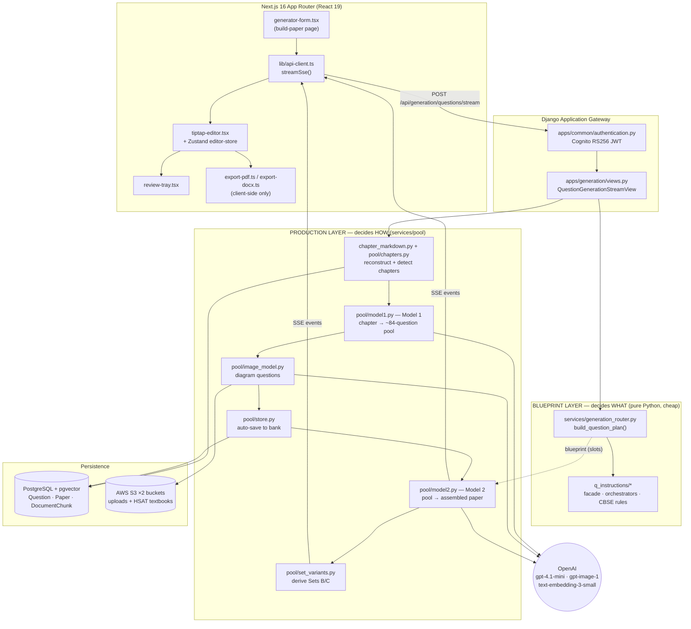

**Reading the diagram.** A request enters through Cognito auth, hits the
`stream` view, and forks immediately into the two layers. The Blueprint Layer
compiles a list of `QuestionGenerationSlot`s (the "what"). In parallel, the
Production Layer reconstructs chapters from persisted chunks, runs Model 1 to
build the pool, adds image questions, auto-saves the whole pool to the bank, and
finally runs Model 2 to *select* the slots' questions from the pool. Both layers
converge at Model 2, which is the only place the "what" and the "how" meet.

### 2.2 The request lifecycle

This is the end-to-end sequence for a full generation
(`stream_pool_questions` in `services/pool/pipeline.py`). Note that the pool is
saved to the bank **before** the paper is assembled — the bank keeps the *whole*
pool, not just the questions this paper used.

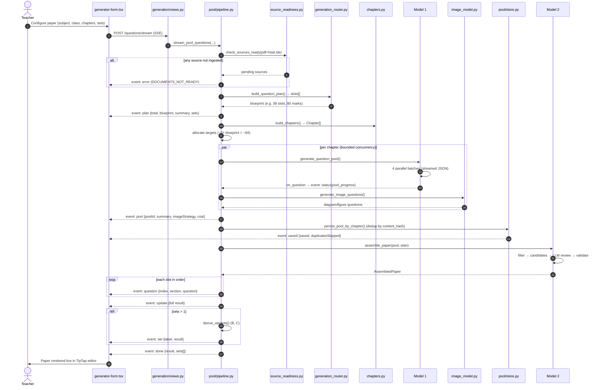

### 2.3 The blueprint resolution sequence

The Blueprint Layer resolves subject-specific structure *deterministically*.
Social Science is the most instructive example because CBSE splits it into four
sub-streams (History, Geography, Civics, Economics) with asymmetric rules —
History carries the case-study slots, Economics forbids certain question types,
and OR-choices land on specific mark bands. All of this is Python, not an LLM
prompt.

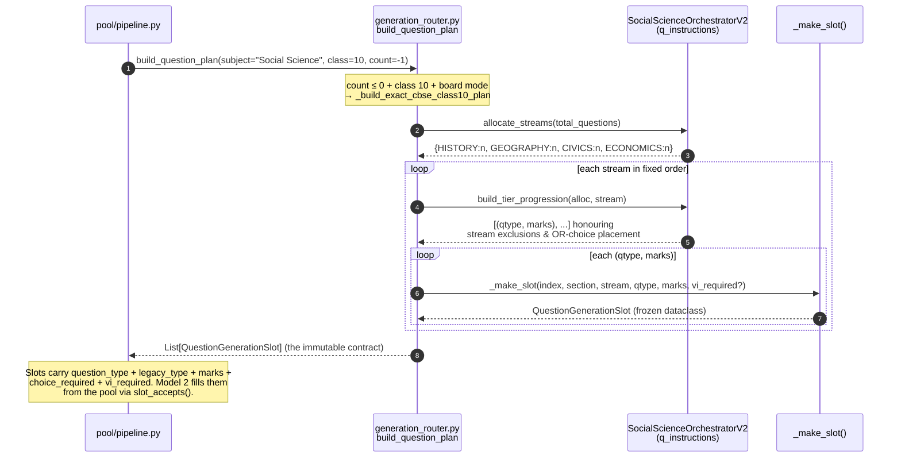

The output of this layer is a list of **`QuestionGenerationSlot`** frozen
dataclasses (`services/generation_router.py:62`). Each slot is *"a deterministic,
pre-LLM contract for exactly one generated question"* — index, section title,
subject, stream, `question_type`, coarse `legacy_type`, marks, difficulty,
`choice_required`, `requires_image`, `vi_required`. The LLM may write *wording*;
it never decides counts, marks, sections, or routing. This is what makes the
paper's structural correctness a property of the code rather than a hope about
the model.

---

## 3. Comprehensive File & Folder Directory

```
qp-gen/
├── ARCHITECTURE.md              ← this document
├── README.md                    ← legacy aspirational manual (partly stale)
├── CLAUDE.md                    ← agent working notes (source of truth for gotchas)
├── deployment/                  ← prod runbooks (nginx, systemd, migration)
│
├── backend/                     ← Django 5 + DRF API
│   ├── manage.py
│   ├── requirements.txt
│   ├── config/                  ← Django project (settings, urls, wsgi/asgi)
│   │   ├── settings.py          ← ALL env-driven config + feature flags
│   │   ├── urls.py              ← root URLConf (APPEND_SLASH=False)
│   │   └── debug_views.py       ← /debug/science-engine-health
│   │
│   ├── apps/                    ← Django apps (thin — HTTP + models only)
│   │   ├── accounts/            ← User model (Cognito-backed), auth endpoints
│   │   ├── common/              ← auth, permissions, PortableArrayField, serve_media
│   │   ├── documents/           ← PdfSource, HsatSource, DocumentChunk; upload views
│   │   ├── generation/          ← the SSE stream views + GenerationHistory/ApiUsage
│   │   ├── projects/            ← Project, Paper, PaperSet, Question, ExportRecord
│   │   ├── question_generation/ ← REFACTORED blueprint engine (behind flag) + LLM providers
│   │   └── storage/             ← export/download endpoints
│   │
│   ├── services/               ← the actual business logic (fat services, thin apps)
│   │   ├── generation_router.py ← BLUEPRINT entry: build_question_plan (2994 lines)
│   │   ├── chapter_markdown.py  ← reconstruct a chapter as Markdown from chunks
│   │   ├── document_service.py  ← PDF/DOCX upload → chunk → embed (ingestion)
│   │   ├── semantic_pipeline.py ← header/footer strip + chapter-aware chunking
│   │   ├── chunking_service.py  ← plain overlapping-window chunker (fallback path)
│   │   ├── embedding_service.py ← text-embedding-3-small
│   │   ├── retrieval_service.py ← pgvector L2 nearest-neighbour (RAG for answer scripts)
│   │   ├── source_readiness.py  ← authoritative "is this upload ingested?" gate
│   │   ├── cognito_service.py   ← JWKS fetch + RS256 token validation
│   │   ├── openai_service.py    ← shared OpenAI client, usage recording, caption gate
│   │   ├── answer_script_service.py ← CBSE marking-scheme generator
│   │   ├── content_filters.py   ← scrub figure-label residue / blueprint leakage / VI blocks
│   │   ├── media_urls.py        ← stable vs presigned media URL authority
│   │   ├── paper_content_service.py ← DB-authoritative + best-effort S3 mirror of paper content
│   │   ├── s3_client.py         ← HSAT-bucket boto3 client (region-correct)
│   │   ├── hsat_service.py / hsat_catalog.py ← shared textbook catalogue
│   │   ├── syllabus_scope.py    ← off-syllabus exclusions, Bloom bias, Maths bands
│   │   └── pool/                ← ★ THE PRODUCTION LAYER ★
│   │       ├── pipeline.py       ← stream_pool_questions (SSE orchestrator)
│   │       ├── chapters.py       ← chapter detection + oversized-chapter splitting
│   │       ├── recipes.py        ← per-subject question-type quotas (the pool "shape")
│   │       ├── model1.py         ← Model 1: chapter Markdown → pool
│   │       ├── streaming.py      ← incremental JSON-object stream extractor
│   │       ├── schema.py         ← PoolQuestion contract + normalisation + slot_accepts
│   │       ├── image_model.py    ← generate/reuse/hybrid diagram questions
│   │       ├── store.py          ← persist pool to bank + load bank + dedup
│   │       ├── model2.py         ← Model 2: 5-stage selection (solver + LLM review)
│   │       ├── set_variants.py   ← derive Sets B/C from a master paper
│   │       ├── from_bank.py      ← assemble a paper from saved questions (skip Model 1)
│   │       ├── gim.py            ← "General Instructions Mode" free-text spec parser
│   │       └── rendering.py      ← printable content (OR-labels, VI blocks)
│   │
│   ├── q_instructions/         ← LEGACY blueprint engine (LIVE DEFAULT, flag=false)
│   │   ├── master/facade.py     ← AcademicGenerationFacade entry
│   │   ├── core/                ← enums (QuestionTypeCode, StreamType), datatypes, validators
│   │   ├── subjects/            ← per-subject orchestrators (science, social_science, …)
│   │   ├── board_systems/cbse/  ← CBSE-specific rules
│   │   ├── orchestration/       ← choices, spacing, psychology, choreography
│   │   └── tests/               ← architecture + parity + language-logic tests
│   │
│   └── utils/ids.py            ← generate_id() (32-char ids, Prisma-compatible)
│
└── frontend/                   ← Next.js 16 (App Router / Turbopack), React 19
    ├── next.config.ts          ← pins Turbopack root to frontend/ (do not remove)
    ├── app/
    │   ├── (auth)/             ← login, register, forgot/reset password
    │   └── (dashboard)/        ← dashboard, build-paper, editor, question-bank,
    │                             paper-library, settings
    ├── components/
    │   ├── generator-form.tsx   ← the generation form + SSE consumer (1551 lines)
    │   ├── tiptap-editor.tsx     ← the WYSIWYG paper editor (1815 lines)
    │   ├── review-tray.tsx       ← staged-question review/insert UI
    │   ├── comparison-workspace.tsx ← multi-set A/B/C side-by-side
    │   └── editor/extensions/    ← custom TipTap nodes (pages, math, drawing, OR-groups)
    ├── lib/
    │   ├── api-client.ts        ← streamSse() + REST wrappers + token refresh
    │   ├── cognito-client.ts / auth-*.ts ← Cognito SRP auth on the client
    │   ├── export-pdf.ts        ← html2canvas + jsPDF (client-side)
    │   └── export-docx.ts       ← the `docx` package (client-side)
    └── store/editor-store.ts    ← Zustand store (persisted to localStorage)
```

---

## 4. Technology Stack

| Concern | Choice | Why |
|---|---|---|
| Backend framework | **Django 5.0 + DRF 3.15** | Mature ORM over a pre-existing Prisma schema; DRF for the auth/permission stack. |
| Database | **PostgreSQL + pgvector 0.2.5** | Relational bank + 1536-dim embedding column in one store; `VectorField` on `DocumentChunk`. |
| LLM provider | **OpenAI** (`openai>=2.36`) | `gpt-4.1-mini` (large context, high TPM) for Models 1 & 2; `gpt-image-1` for diagrams; `text-embedding-3-small` for retrieval. |
| Auth | **AWS Cognito** (RS256 JWT, PyJWT + cryptography) | Managed user pool; backend validates tokens against pool JWKS. |
| Object storage | **AWS S3 ×2** (`django-storages` + a raw boto3 client) | Uploads/generated-images bucket + read-only HSAT textbook bucket, possibly in different regions. |
| Cache | **Redis (optional) / LocMemCache** | Shared cache for multi-instance deploys; degrades to per-process LocMem. |
| Frontend | **Next.js 16 (App Router, Turbopack) + React 19** | Route groups, RSC-ready, fast dev. |
| Editor | **TipTap 3.23** (ProseMirror) | Custom NodeViews for A4 pages, math, drawings, OR-groups. |
| Client state | **Zustand** (persisted) + **TanStack Query** | Editor store in localStorage; server-state caching for REST. |
| Export | **html2canvas + jsPDF**, **docx** | 100% client-side PDF/DOCX — there is no server-side export. |

---

## 5. The Persistence Layer & Data Model

The schema is **pre-existing** (originally created by Prisma). This is a hard
constraint that explains several oddities you will see in migrations:
capitalised `db_table` names (`Project`, `Paper`, `Question`, `ExportRecord`)
and camelCase columns (`userId`, `contentHash`, `poolId`). New Django models
match this convention rather than fighting it.

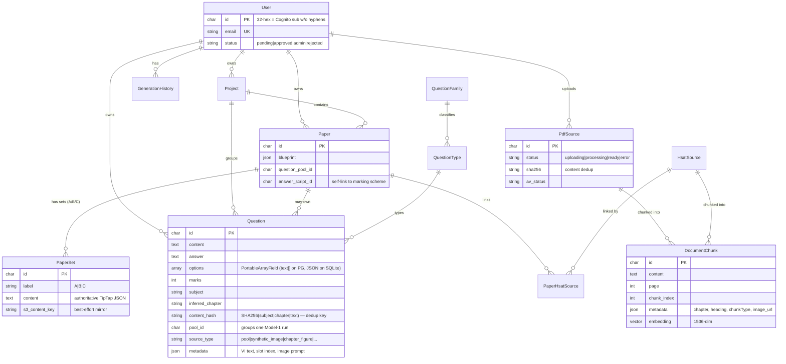

**Load-bearing details:**

- **`Question.options` is a `PortableArrayField`** (`apps/common/fields.py`),
  not a plain `ArrayField`. It renders as a Postgres `text[]` in production but
  round-trips as JSON on SQLite so the auto-save path is testable — and it
  *deconstructs as `ArrayField`* so `makemigrations` sees no change and never
  tries to ALTER the live table. This exists because the pool auto-saves every
  generated MCQ, making the write path central and therefore test-critical.
- **`content_hash` is a plain index, not a UNIQUE constraint.** The live table
  predates the pool and may already hold duplicates from the old manual-save
  flow; a unique index could not be built over it. Dedup is therefore enforced
  in application code (`pool/store.py::persist_pool`), not by the DB.
- **`pool_id`** groups every question from one Model 1 run, which is what makes
  "regenerate a different paper from the same pool" possible without re-running
  Model 1.
- A **`DocumentChunk` belongs to exactly one of** `PdfSource` (user upload) or
  `HsatSource` (shared textbook). Both live in the same table so retrieval
  treats them as one pool.

---

## 6. Subsystem: Authentication

**AWS Cognito, Path A (a public app client with *no* secret).** The frontend
performs the Cognito login (SRP) via `lib/cognito-client.ts` and sends the
access token as a `Bearer` header. The backend validates that token itself
against the pool's JWKS — it does not call Cognito on every request.

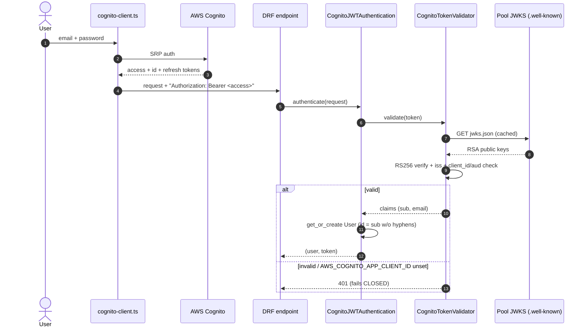

**Why it fails closed.** `AWS_COGNITO_APP_CLIENT_ID` has **no hard-coded
default** (`config/settings.py:181`). A previous literal contained an `ℓ/1`
typo that silently broke the `client_id`/`aud` check and rejected every token;
the fix was to make an unset value reject all tokens rather than trust a wrong
client. The value **must** match the frontend's
`NEXT_PUBLIC_AWS_COGNITO_APP_CLIENT_ID`. PyJWT needs the `cryptography` package
to build the RSA key from the JWKS — without it *every* authenticated request
fails with `Algorithm 'RS256' could not be found` (this is why `cryptography`
is a hard requirement, annotated in `requirements.txt`).

Approval gating: DRF's default permission is `IsApprovedOrAdmin`, so a
newly-created `User` (`status="pending"`) is authenticated but not yet
authorised until an admin approves them.

---

## 7. Subsystem: Document Ingestion

Uploading a PDF is decoupled from generation. `document_service.py` turns a file
into `DocumentChunk` rows with embeddings, and returns a `PdfSource` id
*before* ingestion finishes (async). The client polls a status endpoint; the
generation pipeline independently re-verifies readiness (defence in depth).

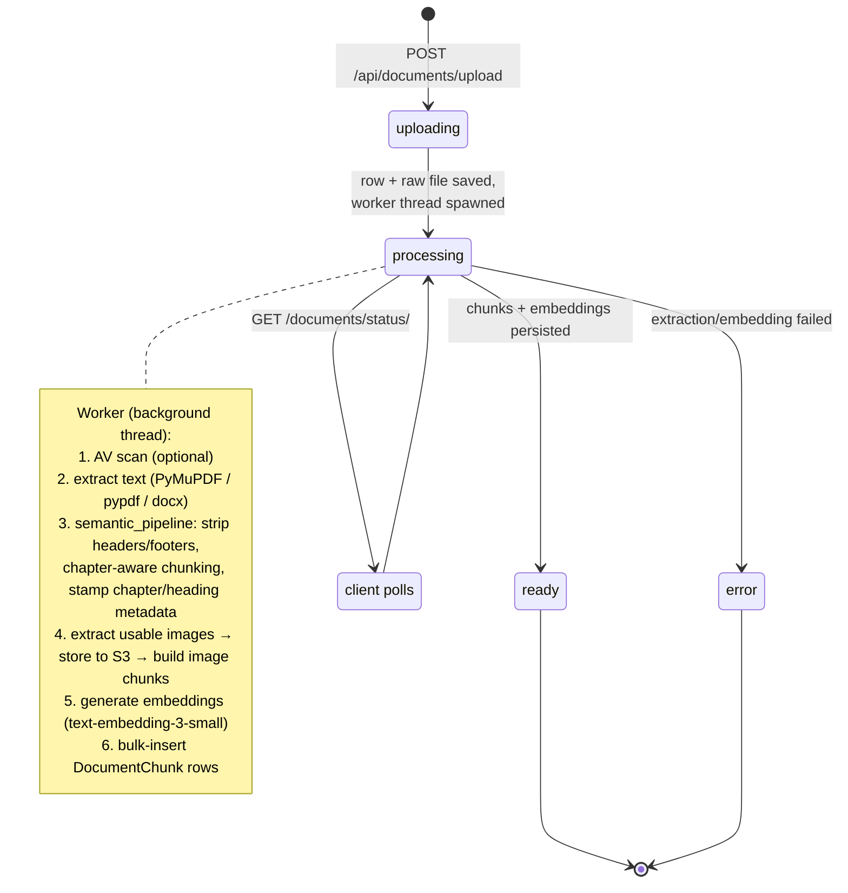

**Two chunking paths, deliberately.** `semantic_pipeline.py` is the primary path
for PDFs: it detects and removes repeated headers/footers (a line appearing on
≥30% of pages), then splits into chapter-aware chunks carrying
`chapter`/`heading` metadata, embedding a `# chapter / ## heading` prefix in the
chunk content. These chunks are **non-overlapping**. The fallback path,
`chunking_service.chunk_text` (used for DOCX, txt, and degenerate PDFs), produces
plain ~1000-char windows with 200-char overlap. This duality is why chapter
reconstruction (§8) has to detect and trim overlap on one path but not the other.

Two upload routes exist:

- `POST /api/documents/upload` — multipart; backend saves and processes.
- `POST /api/documents/presign` → direct-to-S3 → `POST /api/documents/confirm` —
  avoids a double-save by processing the already-stored object.

Alongside user uploads, **HSAT sources** (`HsatSource`) are *shared, global*
textbook ingestions — one record per `(grade, subject, book)`, not scoped to a
user. A paper links to them via `PaperHsatSource` so many users can draw on the
same textbook chunks with zero duplication.

---

## 8. Subsystem: Chapter Reconstruction & Detection

Model 1 reads a **whole chapter** in one pass, so it needs the chapter as a
single coherent Markdown document. Nothing stores that today — ingestion
discards the full text and keeps only ~60-100 chunks. Rather than add a
`markdown_content` column (a migration + backfill + re-upload of every existing
PDF), the system **reconstructs** the document from the chunks that already
exist. This works identically for old and new rows, uploads and HSAT books.

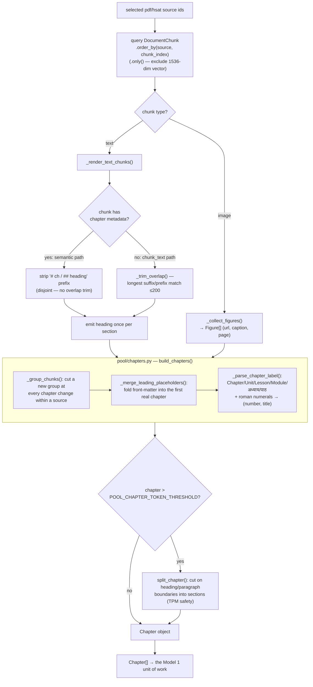

**The unit of generation is a chapter, never a file and never the whole
upload.** `build_chapters` handles three shapes transparently: several
single-chapter PDFs, one textbook with many chapters, or a mix. Boundaries come
from *content* metadata, not filenames. An oversized chapter is split into
sections by `split_chapter` so no single Model 1 request can breach the org's
tokens-per-minute (TPM) ceiling; the section pools are merged back under the
parent chapter title so the bank keeps a chapter's questions together.

A `Chapter` also carries **provenance** — source PDF name and page span — which
is stamped onto every generated question's metadata so a paper is fully
traceable to its source.

---

## 9. Subsystem: The Blueprint Engine

This is the "what" layer. Entry point: `build_question_plan` in
`services/generation_router.py`.

### Routing & eligibility

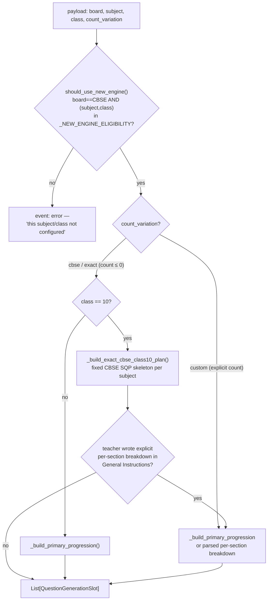

Eligibility (`_NEW_ENGINE_ELIGIBILITY`): Science & Social Science for **classes
1–10**; Mathematics, English, Hindi, Telugu for **class 10** only. Subject
aliases (`maths`→`mathematics`, `sst`→`social science`, math code 041/241, etc.)
are normalised first.

**Precedence rule (easy to miss):** even in board mode, if the teacher wrote an
explicit per-section breakdown in the free-text General Instructions, that
breakdown *wins* over the fixed CBSE blueprint. The blueprint is the default;
explicit instructions are never silently overwritten.

### The dual-engine migration

There are **two copies** of the blueprint engine:

- `q_instructions/` — the **legacy, live default**.
- `apps/question_generation/` — a refactored copy (clean architecture: `domain`,
  `services`, `infrastructure`, `adapters`).

Routing is gated by the `QG_NEW_ENGINE_ENABLED` flag, which **defaults to
`false`** — so `q_instructions/` is what actually runs.
`apps/question_generation/tests/test_parity.py` guards that both engines produce
equivalent output. When editing blueprint logic you must decide which engine you
are touching and keep parity, or you will change behaviour only under a flag
nobody has set.

> Note: the pool pipeline's LLM provider abstraction
> (`apps/question_generation/infrastructure/providers/openai_provider.py`,
> exposing `OpenAIProvider` / `LLMRequest` / `LLMMessage`) lives inside the
> refactored app and **is used unconditionally** by Model 1, Model 2 and the
> image stage — it is the shared OpenAI client seam regardless of the engine flag.

---

## 10. Subsystem: The Pool Pipeline

This is the production layer — `services/pool/`. The whole thing is orchestrated
by `stream_pool_questions` (`pipeline.py`) and streams over SSE.

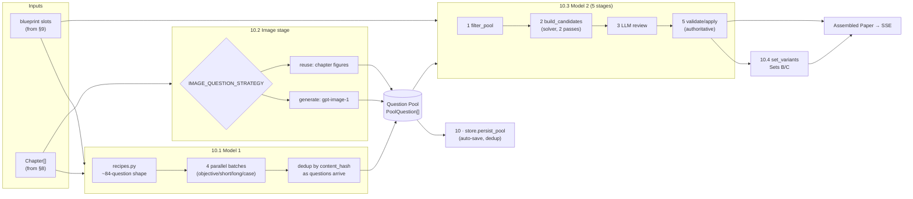

### 10.1 Model 1 — chapter → pool

`model1.py::generate_question_pool`. The old path issued one retrieval + one LLM
call per slot (38 calls, each seeing only its four retrieved chunks). Model 1
instead reads the **entire chapter once per batch** and writes questions with
knowledge of the whole thing — ~10× cheaper, and even coverage instead of
retrieval-clustered questions.

**Why batches?** Output length. ~84 questions is 15–20k completion tokens, past
the point where a single response stays reliable. So `recipes.py` splits the
pool by *question shape* into (for content subjects) four batches —
`objective`, `short`, `long`, `case_study` — run in parallel. Each batch still
sees the whole chapter, which is what prevents any batch from over-indexing on
one section.

**Prompt ordering is load-bearing** (`_build_request`): system prompt → **full
chapter** → tiny batch instruction. All four batches share the enormous
chapter prefix, so putting the only varying part *last* lets OpenAI's automatic
prefix cache discount batches 2–4.

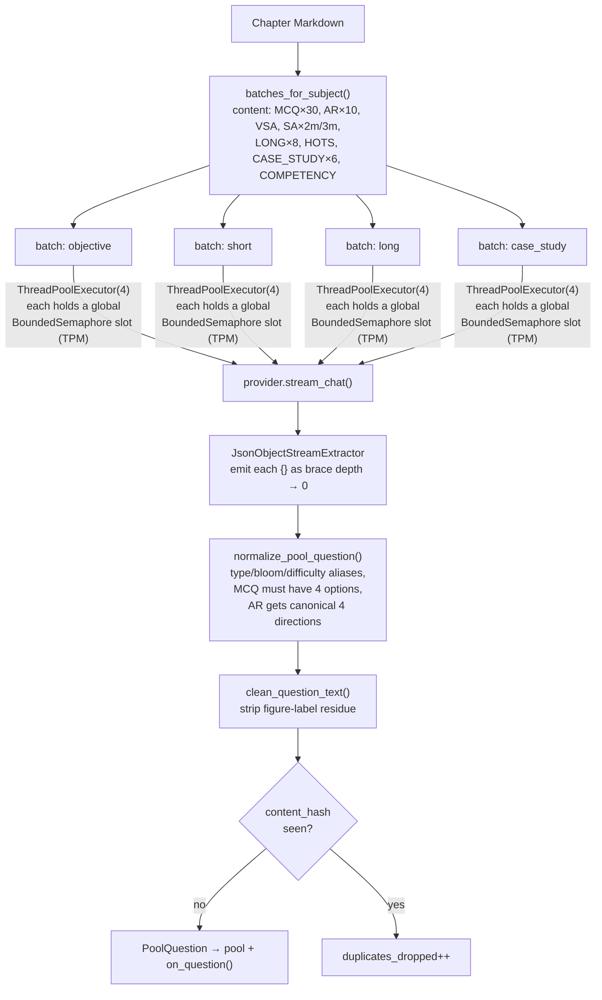

**Concurrency safety.** Chapters generate in parallel *and* each runs up to four
batches, so naive fan-out would be `chapters × batches` concurrent OpenAI
requests — enough to blow the TPM ceiling. A **process-wide
`BoundedSemaphore`** (`POOL_MAX_CONCURRENCY`) caps total in-flight Model 1
requests regardless of how many chapters/batches are running. Combined with the
per-chapter token threshold, `concurrency × request-size` stays under TPM.

**Streaming JSON.** Model 1 is told to return a bare JSON *array* (not a wrapper
object). A wrapper only closes on the final token, so nothing could stream until
the whole 80-question batch finished. `streaming.py::JsonObjectStreamExtractor`
emits each object the instant its brace depth returns to zero — tracking string
state so a `{` inside a Maths stem (`the set {1,2,3}`) doesn't corrupt the count.
A single malformed object is skipped, never aborting the batch.

**The `PoolQuestion` contract** (`schema.py`) is the lingua franca of the whole
production layer: Model 1, the image stage, the store, and Model 2 all speak it.
Its type vocabulary is deliberately a *superset of* `q_instructions`'
`QuestionTypeCode` so Model 2 can map pool questions onto blueprint slots with no
lossy translation table (`slot_accepts()`).

### 10.2 The image stage

`image_model.py` runs between Model 1 and Model 2. It has three strategies,
selected by `IMAGE_QUESTION_STRATEGY` (default **`hybrid`** in `settings.py`):

| Strategy | Behaviour | Cost/Risk |
|---|---|---|
| `generate` | A text model proposes diagram specs; `gpt-image-1` draws each; the question is written against the drawing. | ~20× a text question; an AI-drawn circuit can be subtly wrong. |
| `reuse` | Questions written about figures already extracted from the chapter (captioned at ingest). | Cheap; figure guaranteed real. |
| `hybrid` | Reuse the chapter's own figures first; synthesise only the remainder. | Balanced (the default). |

Every *synthesised* question is tagged `source_type="synthetic_image"` and
`requiresReview=true`, so the review tray flags it for a teacher before it
reaches a real exam. Diagrams are cached by **prompt hash** in S3
(`generated_diagrams/<sha>.png`) so an identical diagram is never billed twice —
across pools, chapters, or users. The image cap (`IMAGE_QUESTIONS_PER_POOL`,
default 8) is the single biggest cost lever; the pipeline further shrinks it to
a *contextual* budget (`_contextual_image_total`) so images appear only where
they help (0 for language subjects, more for Science/Maths, honouring explicit
`DIAGRAM` slots first).

### 10.3 Model 2 — pool → paper

`model2.py::assemble_paper`. **Model 2 never writes questions — it selects
them**, in five stages. The split between solver and model is the core design
idea:

> Constraint satisfaction (exact marks, exact counts, no duplicate ids, Bloom &
> difficulty spread, chapter weighting) is a *solver* problem — cheaper, faster
> and more reliable in Python than in a model. Judging whether two questions
> test the same idea in different words is *not* a solver problem, and it is the
> only thing the model is asked to do.

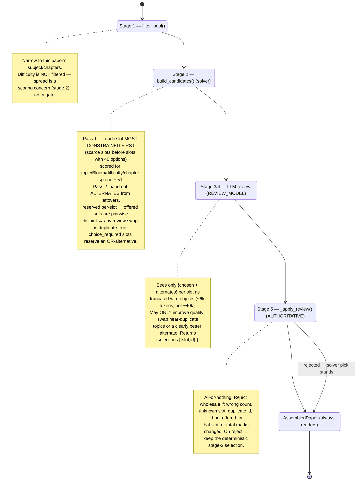

The two-pass candidate builder is subtle and worth internalising: **Pass 1 fills
most-constrained slots first** so a rare 5-mark case study isn't starved by a
common slot consuming its only match; **Pass 2 reserves alternates per-slot** so
the offered candidate sets are pairwise disjoint — which is precisely what
guarantees that *any* per-slot choice the review model makes is automatically
duplicate-free. Stage 5 is authoritative *because a half-trusted selection is
harder to reason about than a deterministic one*; the paper always renders.

`assemble_paper(use_review=False)` makes assembly fully deterministic for a given
`(pool, plan, seed)` — two teachers generating from the same saved bank then get
byte-identical papers. This is how "Paper-from-Bank" (§10.5) offers a
`deterministic` mode.

### 10.4 Multiple sets

`set_variants.py` derives Sets B and C from the assembled master (Set A) and the
*same* pool — **no new questions, no second Model 1 run.** It is a pure,
deterministic, Django-free module (a solver owns it end to end):

- MCQs are **never** replaced (they anchor the objective section across sets).
- ~30% of the remaining questions are replaced in **mark-priority order** (5m →
  3m → 2m), because higher-mark questions carry more of a paper's uniqueness.
- A replacement must parallel the original on subject, chapter, type, marks,
  difficulty and Bloom (topic-strict first, then topic-relaxed fallback — Model
  1's free-text topic labels rarely match verbatim, and without the fallback
  "swap 30%" silently degrades to "swap 0%").
- If no parallel exists, the original is kept rather than the blueprint broken.
- Retained + replaced questions are then shuffled *within* their sections so a
  set doesn't read in master order; sections are never mixed.

Invariants the caller relies on: identical total marks, identical section
structure, no duplicate id within a set. Variant generation is **best-effort** —
a failure there leaves Set A intact.

### 10.5 Paper-from-Bank

`from_bank.py::stream_paper_from_bank` (endpoint `POST
/api/generation/paper-from-bank`) is the payoff of persisting the pool per-row.
A chapter generated once already has ~84 questions in the bank, so building
*another* paper is a single Model 2 review call — roughly two orders of
magnitude cheaper than a fresh generation, and near-instant. It reuses the same
blueprint compiler and the same Model 2; the only difference is that the pool
comes from `store.load_bank()` instead of Model 1.

---

## 11. The SSE Event Contract

The stream is a **hard interface** with the frontend — the editor, review tray,
auto-insert and multi-set switcher all depend on the exact event names and the
question object's field shape. It must be preserved exactly when changing the
pipeline. Every event is `event: <name>\ndata: <json>\n\n`
(`pipeline.py::_sse`).

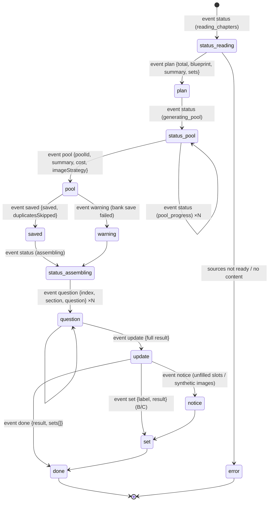

| Event | Payload (key fields) | Meaning |
|---|---|---|
| `status` | `stage`, `message`, `chapters`, `produced/target` | Progress heartbeat through the stages. |
| `plan` | `total`, `blueprint`, `summary`, `generalInstructions`, `sets` | The blueprint was compiled. |
| `pool` | `poolId`, `byType`/`byMarks`/`byBlooms`, `imageStrategy`, `estimatedImageCostUsd` | The pool is complete; coverage + cost stats. |
| `saved` | `saved`, `duplicatesSkipped`, `projectName`, `projectId` | Pool auto-saved to the bank. |
| `question` | `index`, `section`, `question` (wire), `sourceType` | One assembled paper slot (in order). |
| `update` | full `result` (`sections`, `generalInstructions`, `meta`) | The complete Set A document. |
| `set` | `label`, `setIndex`, `result` | A derived set (B/C). |
| `notice` | `message` | Non-fatal: unfilled slots, synthetic-image warning. |
| `warning` | `message` | Non-fatal degradation (e.g. bank save failed). |
| `done` | `result`, `sets[]` | Terminal success; Set A is `result`, all sets in `sets[]`. |
| `error` | `error` (+ `DOCUMENTS_NOT_READY` payload) | Terminal failure. |

The **question wire object** (`_question_to_wire`) is the frontend's contract,
not the pool's: `content` (not `question`), `image_url` (not `image`). An
internal OR-choice is baked into `content` *and* exposed separately as
`or_choice` so the review tray can show both halves. `metadata.slotIndex`
preserves ordering.

The frontend consumer is `lib/api-client.ts::streamSse`, which reads the
`ReadableStream`, splits on `\n\n`, parses `event:`/`data:` lines, and dispatches
to an `onEvent(event, data)` handler — with a transparent 401 → token-refresh →
retry.

---

## 12. Subsystem: Storage & Media URLs

**The database only ever stores a permanent path** (an S3 object key or a
`MEDIA_ROOT`-relative path) — **never a presigned URL**, because a presigned URL
stored at ingest time is guaranteed stale by the time a teacher opens the paper
hours later (the infamous `invalid_image_url` OpenAI 400). `media_urls.py` is the
single authority, with two flavours:

- **`stable_media_url(path)`** → an app-stable `/media/<path>` URL that never
  expires. Safe to persist in chunk metadata, question payloads, and TipTap
  documents. Served by `apps/common/views.py::serve_media`
  (route `^media/(?P<path>.+)$`), which **redirects to a fresh presigned URL**
  when storage is remote, or streams from `MEDIA_ROOT` locally.
- **`fresh_signed_media_url(path)`** → a short-lived signed URL minted at call
  time, only for immediate consumption (an OpenAI vision download, the `/media/`
  redirect response). Never stored.

**Two S3 buckets, possibly in different regions:**

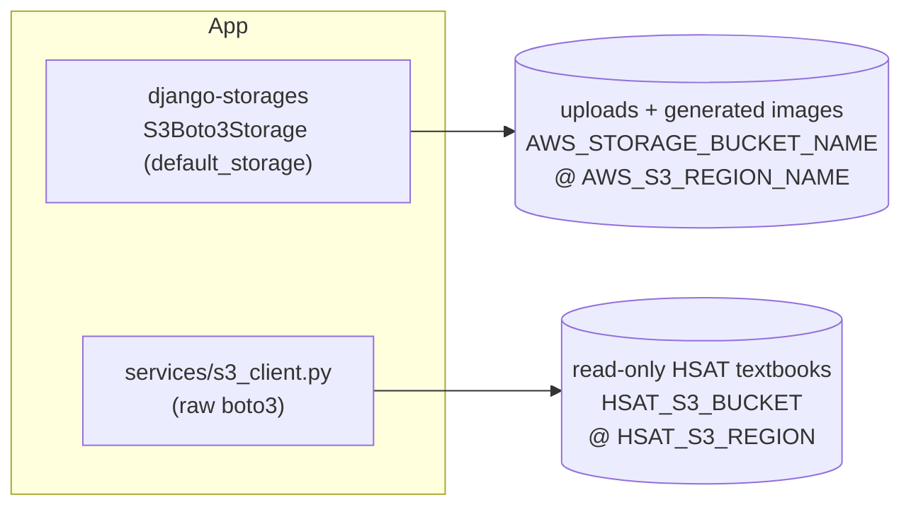

Each client **must sign for its own bucket's region** or you get a `403
AuthorizationHeaderMalformed`. When `HSAT_S3_*` are unset they fall back to the
uploads bucket/region so single-bucket (and local MinIO) deployments work
unchanged. Leaving a bucket name empty falls back to the local `media/` folder.

**Statelessness.** `PaperSet.content` is dual-written: DB first (authoritative),
then a best-effort S3 mirror at `paper-content/{userId}/{paperId}/{setId}.json`
(`paper_content_service.py`). `PAPER_CONTENT_SOURCE` (`db`|`s3`) selects the read
source; flipping to `s3` is a pure env change after a backfill, and flipping back
is equally cheap. Logging is **stdout/stderr only** (no `FileHandler`) because an
EC2 instance's disk is ephemeral and the supervisor forwards streams to
CloudWatch.

---

## 13. The Frontend

Next.js 16 App Router with two route groups:

- **`app/(auth)/`** — `login`, `register`, `forgot-password`, `reset-password`.
- **`app/(dashboard)/`** — `dashboard`, `build-paper`, `editor`,
  `question-bank`, `paper-library`, `settings`.

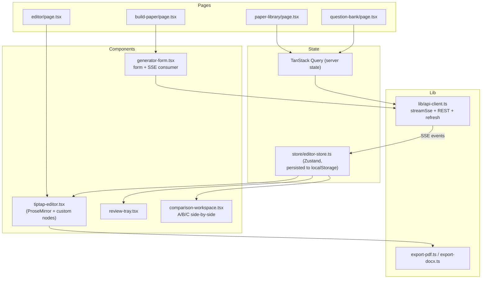

**Insertion modes.** The Zustand store models a `review` vs `auto` insertion
mode. In review mode each streamed question lands in the **review tray** as a
`TrayItem` (badged by `sourceType` — `pool`, `chapter_figure`,
`synthetic_image`, or legacy `rag`/`curriculum_fallback`), and the teacher
inserts or dismisses. In auto mode questions flow straight into the document.
`SectionToAppend.setLabel` lets multiple sets coexist in one document (headers
render as "Set B · Section A") without merging under a shared section header.

**The editor** (`tiptap-editor.tsx`, 1815 lines) is the heart of the client. It
uses custom TipTap NodeViews under `components/editor/extensions/`: `page-node`
(A4 pages), `pagination-engine` (content reflow across pages), `math-nodes`
(KaTeX), `drawing-node`, `float-image`, and `or-group-invariant` (keeps an
"OR" question pair structurally intact). `store/editor-store.ts` persists the
document to localStorage so a refresh doesn't lose work.

**Export is 100% client-side.** `export-pdf.ts` rasterises the editor DOM with
html2canvas and lays it into jsPDF; `export-docx.ts` builds a `.docx` with the
`docx` package. There is no server-side export path (`services/export_service.py`
is an intentional placeholder).

> `next.config.ts` pins the Turbopack `root` to `frontend/`. Do **not** remove
> it — without it Next walks up to the monorepo root and watches ~69k files
> (backend + `.git`), pegging the CPU.

---

## 14. Configuration & Feature Flags

All backend config is env-driven (`config/settings.py`, template in
`backend/.env.example`). `DATABASE_URL` is **required** at runtime (settings
raises if missing) — the only exception is tests, where settings swaps to
in-memory SQLite when `test` is in `sys.argv`.

| Var | Effect | Default |
|---|---|---|
| `QG_NEW_ENGINE_ENABLED` | route blueprint through `apps/question_generation/` vs `q_instructions/` | `false` |
| `POOL_MODEL` | Model 1 + image-spec model (independent of `OPENAI_MODEL`) | `gpt-4.1-mini` |
| `REVIEW_MODEL` | Model 2 review model | `gpt-4.1-mini` |
| `ANSWER_MODEL` | answer-key / answer-script model | `gpt-4.1-mini` |
| `IMAGE_QUESTION_STRATEGY` | `generate` / `reuse` / `hybrid` | `hybrid` |
| `IMAGE_QUESTIONS_PER_POOL` | hard cap on image questions (biggest cost lever; `0` disables) | `8` |
| `POOL_MAX_CONCURRENCY` | process-wide cap on concurrent Model 1 requests (TPM) | `4` |
| `POOL_CHAPTER_CONCURRENCY` | chapters generated in parallel | `3` |
| `POOL_CHAPTER_TOKEN_THRESHOLD` | split a chapter larger than this (input tokens) | `20000` |
| `POOL_MIN_QUESTIONS_PER_CHAPTER` | floor per-chapter slice of the pool | `12` |
| `PAPER_CONTENT_SOURCE` | `db` or `s3` for reading paper content | `db` |
| `REDIS_URL` | shared cache backend when set | unset (LocMem) |
| `PDF_IMAGE_CAPTION_CONCURRENCY` | vision-caption thread pool; do not raise (TPM) | `3` |

> **Per-stage model isolation is deliberate:** `POOL_MODEL` / `REVIEW_MODEL` /
> `ANSWER_MODEL` do **not** fall back to `OPENAI_MODEL`. A deployment that set
> `OPENAI_MODEL=gpt-4o` (a 30k-TPM model) must not drag Model 1's whole-chapter
> request into that ceiling.

---

## 15. Deployment Topology

Runbooks live in `deployment/` (`POOL_MIGRATION.md`, `nginx.conf`,
`qp-gen-backend.service`).

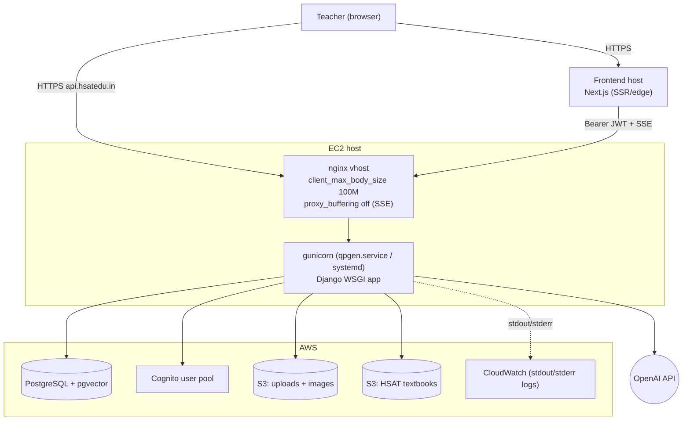

Key deployment constraints already baked into the code: SSE responses set
`Cache-Control: no-cache` and `X-Accel-Buffering: no`, and nginx must have
`proxy_buffering off` for the stream to reach the client incrementally; upload
bodies are capped at 100M at both nginx and Django; the app is designed to run
**stateless** (shared Redis cache, S3-mirrored content, console-only logging) so
it can scale to multiple instances behind a load balancer.

---

## 16. Design Trade-offs & Alternatives Considered

| Decision | Alternative considered | Why the current design won |
|---|---|---|
| **Pool architecture** (read chapter once, over-provision, then select) | Per-slot RAG + one LLM call per question (the old engine) | ~10× cost, and retrieval-clustered questions produced uneven chapter coverage. The pool sees the whole chapter and covers it evenly. |
| **Solver + single LLM review** in Model 2 | Let the LLM assemble the whole paper | A solver is cheaper/faster/more reliable at exact-marks/exact-count constraint satisfaction; the LLM is reserved for the one thing it's better at (semantic duplication judgement). |
| **Stage 5 is authoritative** (reject bad review wholesale) | Repair a partially-valid review | A half-trusted selection is impossible to reason about later; the deterministic stage-2 pick is always valid, so rejecting costs nothing. |
| **Reconstruct chapters from chunks** | Add a `markdown_content` column | Avoids a migration + backfill + re-upload of every existing PDF; works identically for old and new rows. |
| **Bare JSON array from Model 1** | `response_format=json_object` (a wrapper) | A wrapper only closes on the last token — nothing could stream. A bare array lets each question stream as it closes. |
| **`content_hash` index, app-level dedup** | `UNIQUE` constraint | The live Prisma table already holds duplicates; a unique index couldn't be built without a data cleanup first. |
| **`PortableArrayField`** | Migrate `options` to `JSONField`, or keep `ArrayField` | Keeps the prod `text[]` column (migration-invisible) while making the auto-save path testable under SQLite. |
| **Store paths, mint presigned URLs on use** | Persist presigned URLs | Persisted presigned URLs expire and cause OpenAI `invalid_image_url` 400s hours later. |
| **Dual blueprint engines behind a flag** | Big-bang replace `q_instructions/` | Parity tests + a default-off flag let the refactor land safely without changing live behaviour. |
| **Diagram cache by prompt hash** | Regenerate per pool | `gpt-image-1` is ~85% of a generation's cost; identical diagrams recur across regenerations/users. |
| **Client-side export** | Server-side PDF/DOCX rendering | Keeps the backend stateless and offloads rasterisation; the editor DOM is already the source of truth. |

---

## 17. Testing Strategy

Tests are Django `TestCase`s (**not** pytest) and need no DB setup — settings
auto-swaps to in-memory SQLite when `test` is in `sys.argv`. They live both in
app `tests.py` files and in `test_*.py` modules under `services/` and
`services/pool/`.

```bash
cd backend && source venv/bin/activate      # venv is venv/, NOT .venv
python manage.py test                        # everything
python manage.py test services.pool          # the pool pipeline suite
python manage.py test apps.projects          # one app
python manage.py test services.pool.test_model1.StreamExtractorTests.test_x  # one test
```

Notable suites:

- `services/pool/test_model1.py` — the streaming JSON extractor and pool
  normalisation.
- `services/pool/test_model2.py`, `test_or_choice.py` — candidate building, the
  authoritative review-apply, and OR-choice reservation.
- `services/pool/test_set_variants.py` — the mark-priority replacement + section
  shuffle invariants.
- `services/pool/test_chapters.py` — chapter detection, placeholder merging,
  oversized-chapter splitting.
- `services/test_content_filters.py`, `test_chapter_markdown.py`,
  `test_source_readiness.py` — the scrub/reconstruction/readiness seams.
- `apps/question_generation/tests/test_parity.py` and `q_instructions/tests/*` —
  dual-engine parity + blueprint architecture invariants.

The frontend has no wired test runner beyond ad-hoc scripts in `frontend/scripts/`.

---

## Appendix A — API Endpoints

`APPEND_SLASH=False` — most generation endpoints have **no trailing slash**.

| Method | Path | Purpose |
|---|---|---|
| `POST` | `/api/generation/questions/stream` | Full generation (Model 1 → pool → Model 2), SSE. |
| `POST` | `/api/generation/paper-from-bank` | Assemble from saved questions (skip Model 1), SSE. |
| `GET` | `/api/generation/bank-summary` | Per-chapter saved-question counts. |
| `POST` | `/api/generation/answer-key` | Answer key for a paper's HTML. |
| `GET`/`DELETE` | `/api/generation/history` | Generation history list / clear. |
| `POST` | `/api/generation/papers/<id>/generate-answer-script/` | CBSE marking scheme as a new paper. |
| `POST` | `/api/documents/upload` | Multipart PDF/DOCX upload (async ingest). |
| `GET` | `/api/documents/status/<id>` | Poll ingestion state. |
| `POST` | `/api/documents/presign` · `/confirm` | Direct-to-S3 upload flow. |
| `*` | `/api/hsat/…` | Shared HSAT textbook catalogue/sources. |
| `*` | `/api/projects/…` | Projects, papers, questions, exports. |
| `*` | `/api/auth/…` | Cognito-backed account endpoints. |
| `GET` | `/media/<path>` | Stable media resolver → presigned redirect / local stream. |

## Appendix B — Environment Variables

See §14 for the behaviour-changing flags. Additional required/notable vars:

- **Required:** `DATABASE_URL`, `OPENAI_API_KEY`, `AWS_COGNITO_APP_CLIENT_ID`
  (fails closed if unset), `AWS_COGNITO_USER_POOL_ID`, `AWS_COGNITO_REGION`.
- **Storage:** `AWS_STORAGE_BUCKET_NAME`, `AWS_S3_REGION_NAME`, `HSAT_S3_BUCKET`,
  `HSAT_S3_REGION`, `AWS_ACCESS_KEY_ID`, `AWS_SECRET_ACCESS_KEY`,
  `AWS_S3_ENDPOINT_URL` (MinIO).
- **Frontend:** `NEXT_PUBLIC_API_BASE_URL`,
  `NEXT_PUBLIC_AWS_COGNITO_APP_CLIENT_ID` (must match the backend),
  `NEXT_PUBLIC_AWS_COGNITO_REGION`.
- **Ops:** `REDIS_URL`, `PAPER_CONTENT_SOURCE`, `DJANGO_ALLOWED_HOSTS`,
  `FRONTEND_URL`, `DJANGO_DEBUG`, `EMAIL_BACKEND`/SMTP vars.

---

*This document reflects the repository as of the current `main` branch. Diagrams
are authored in Mermaid and render natively in GitHub, VS Code, and most
Markdown viewers. When the code changes, update the affected section and its
diagram together — a stale diagram is worse than none.*
