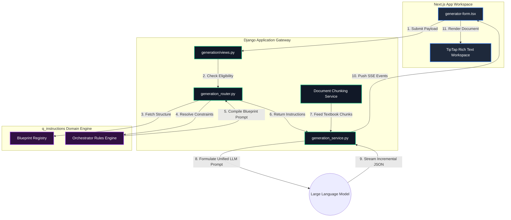
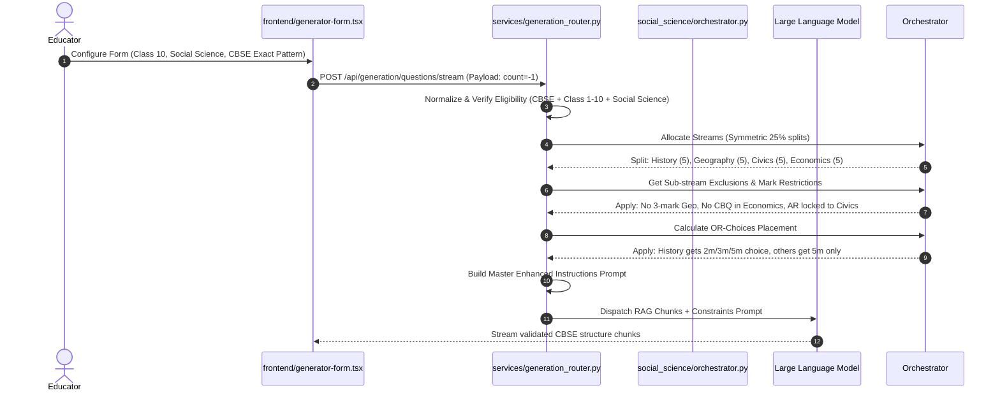

# What Am I: The AOS Academic Question Paper Generator
## Official Engineering and Architecture Manual

---

> [!NOTE]
> This document serves as the absolute Source of Truth for the Academic Orchestration System (AOS) codebase. It is designed to quickly onboard developers, educators, and system architects by precisely defining all sub-components, data-flow vectors, and pedagogical rulesets within the application.

---

## 1. Project Overview & Core Philosophy

The **AOS (Academic Orchestration System) Question Paper Generator** is an advanced, enterprise-grade AI examination builder. Engineered specifically to comply with the strict guidelines of the **Central Board of Secondary Education (CBSE), India**, this system automates the creation of high-stakes assessments while eliminating AI hallucinations, structure deviations, and factual errors.

### The Decoupled Engineering Paradigm

Traditional AI question generators rely on single-prompt instructions, leading to catastrophic structural drifting, incorrect question counts, and non-compliant marks mapping. To solve this, AOS enforces a strict **Decoupled Architecture**:

```
                              ┌────────────────────────────────────────┐
                              │     AOS Decoupled Pipeline Architecture │
                              └───────────────────┬────────────────────┘
                                                  │
                         ┌────────────────────────┴────────────────────────┐
                         ▼                                                 ▼
             ┌───────────────────────┐                         ┌───────────────────────┐
             │   Pedagogical Brain   │                         │   Content Retrieval   │
             │   (q_instructions)    │                         │         (RAG)         │
             ├───────────────────────┤                         ├───────────────────────┤
             │ Enforces layout,      │                         │ Extracts raw fact     │
             │ stream counts, bloom  │                         │ context exclusively   │
             │ targets, and CBSE SQP │                         │ from the educator's   │
             │ structural rules.     │                         │ uploaded textbooks.   │
             └───────────────────────┘                         └───────────────────────┘
```

By keeping the pedagogical structure (the *blueprint*) completely separated from the subject matter (the *content*), the generator achieves mathematically exact board replication while drawing 100% of its curriculum truth from the educator's source documents.

---

## 2. Dynamic System Architecture & Workflows

### 2.1 The End-to-End Generation Loop
The generation loop utilizes a real-time **Server-Sent Events (SSE)** streaming protocol. This ensures that educators can view the structural construction of the paper and answer key incrementally as it synthesizes, rather than waiting for a large final API response.



---

### 2.2 The Blueprint Resolution Sequence
The system automatically compiles grade-tiered rules depending on the subject. When generating a Social Science paper, the system resolves streams asymmetrically to follow the 2025-26 CBSE Sample Question Paper (SQP):



---

## 3. Comprehensive File and Folder Directories

The workspace is cleanly split into two distinct code environments: `/frontend` and `/backend`.

### 3.1 The Frontend Directory Layout (`/frontend`)
The frontend contains **12 subdirectories** and **15 root files**, orchestrating the Next.js presentation layers.

| Folder / File Path | Type | Precise System Purpose |
| :--- | :--- | :--- |
| `/app` | Folder | Next.js App Router root containing page layouts, views, and core CSS routing rules. |
| `/components` | Folder | Houses UI elements, layout wrappers, and the critical `/generator-form.tsx` containing the submission hooks. |
| `/lib` | Folder | Houses client libraries, utilities, and `api-client.ts` containing the Server-Sent Events client logic (`streamSse`). |
| `/store` | Folder | Client-side reactive stores (e.g. Zustand) to coordinate global variables across components. |
| `/actions` | Folder | Next.js Server Actions containing safe API interaction routes. |
| `/prisma` | Folder | Houses database migration models and client declarations for frontend storage. |
| `/public` | Folder | Static visual assets, brand icons, and static assets. |
| `/scripts` | Folder | Development utility scripts used in compilation and builds. |
| `/.agents`, `/.codex` | Folders | Proprietary developmental metadata directories for runtime pair-programming. |
| `/node_modules`, `/.next` | Folders | System packages and local compilation caches. |
| `/components.json` | File | Tailwind UI component layout configurations. |
| `/eslint.config.mjs` | File | Custom lint validation rules for modern TypeScript compilation. |
| `/next.config.ts` | File | Next.js runtime configurations and webpack overrides. |
| `/package.json` | File | Defines frontend packages, dependencies, and scripts (e.g., `"nigga": "next dev"`). |
| `/tsconfig.json` | File | Configures the TypeScript compilation environments. |

---

### 3.2 The Backend Directory Layout (`/backend`)
The backend is a high-performance Django engine containing **7 subdirectories** and **8 root files**.

```
backend/
├── apps/                        # Django Modular Applications (7 subdirectories)
│   ├── accounts/                # Authentication, Token Verification, JWT Management
│   ├── common/                  # Shared base utilities and absolute model mixins
│   ├── documents/               # PDF upload parser, Vectorization, Chunking Systems
│   ├── generation/              # API View layer, SSE Streams, Serializer validators
│   ├── projects/                # User workspace and project organization endpoints
│   └── question_generation/     # Core academic domain schemas and generation interfaces
├── config/                      # Core WSGI, ASGI, Settings, and base system routing
├── services/                    # Business Logic Orchestrators
│   ├── generation_router.py     # Academic blueprint gatekeeper and prompt compiler
│   └── generation_service.py    # SSE stream builder, token allocator, OpenAI/LLM adapter
├── q_instructions/              # The Pedagogical Brain (12 subdirectories)
│   ├── subjects/                # Domain-specific blueprint modules
│   │   ├── science/             # Science blueprints, Biology-Chem-Physics Allocators
│   │   └── social_science/      # Social blueprints, Four-Track asymmetric rules
│   ├── core/                    # Core academic Enums and structures
│   ├── master/                  # Primary generation facades and fallback executors
│   └── retrieval/               # RAG context rankers and context builders
├── utils/                       # Standalone scripts, testing suites, and text formatters
└── manage.py                    # Django CLI administration entry point
```

---

## 4. Deep-Dive Pedagogical Logic Mechanics

> [!IMPORTANT]
> The orchestrator enforces strict layout laws. If the generative model drifts by even one question or assigns invalid marks, the system's runtime validation will flag it as non-compliant.

### 4.1 Subject-Specific Blueprint Injections

#### Science Blueprint Engine (Code 086)
*   **Split Ratio:** Biology (~38%), Chemistry (~31%), Physics (~31%).
*   **Sequence Rules:** Always output questions strictly in the order of **Biology Block** $\rightarrow$ **Chemistry Block** $\rightarrow$ **Physics Block**.
*   **Bloom's Target:** 20% recall (Remembering), 25% comprehension (Understanding), 30% application (Applying), 25% higher-order (Analyzing/Evaluating).

#### Social Science Blueprint Engine (Code 087)
*   **Split Ratio:** Symmetrical 25% allocation across all four tracks (History, Geography, Civics, Economics).
*   **Exclusion Matrix:**
    *   *Geography:* Forbidden from generating 3-mark Short Answer (SA) questions.
    *   *Economics:* Forbidden from generating 2-mark Very Short Answer (VSA) questions and Case-Based Questions (CBQ).
    *   *Civics:* Exclusive domain for Assertion-Reason (AR) multiple-choice questions.
*   **OR Choices placement:** Sourced asymmetrically. History receives choices at the 2m, 3m, and 5m levels, while Geography, Civics, and Economics receive them ONLY at the 5m level.

---

### 4.2 Dynamic Exact Pattern Compilation Logic
When an educator requests the official board blueprint (`count = -1` payload), the prompt assembler shifts the generation guidelines to enforce standard exact count parameters. 

Below is the dynamic system prompt translation logic:

```python
# From backend/services/generation_service.py
if count > 0:
    count_instruction = f"EXACTLY {count}"
else:
    count_instruction = "questions strictly following the official CBSE blueprint count and pattern"
    
topic_instruction = f" about '{topic}'" if topic else ""

prompt = (
    f"CRITICAL REQUIREMENT: You MUST generate {count_instruction} of {difficulty} difficulty{topic_instruction}.\n"
)
if count > 0:
    prompt += "Do NOT stop early. You must fulfill the exact count requested.\n"
    
prompt += "Also ensure that you assign realistic 'marks' based on question type (MCQ=1, ASSERTION_REASON=1, SHORT=3, LONG=5, CASE_STUDY=4)."
```

---

## 5. Architectural Quality Checklist

1.  **Strict Isolation:** No textbook vector chunks are written to persistent databases during generation; they remain within volatile memory context paths.
2.  **No Structure Drift:** Marks matches are mathematically validated before streaming:
    $$\text{MCQ} = 1m \quad | \quad \text{AR} = 1m \quad | \quad \text{VSA} = 2m \quad | \quad \text{SA} = 3m \quad | \quad \text{CBQ} = 4m \quad | \quad \text{LA} = 5m$$
3.  **Real-Time Rendering:** The Next.js frontend catches the SSE buffer and feeds it directly into the TipTap Editor, enabling real-time typing animation for the educator.
