# AOS — Architecture & Engineering Thesis

> A CBSE-compliant, AI-native question-paper generator.
> This document is the authoritative technical reference for the `qp-gen`
> monorepo. It is written to be read top-to-bottom as a thesis on *why* the
> system is shaped the way it is, not merely *what* it does. Every claim here is
> grounded in the source tree as of `main@d6e7a9d` (2026-09-15). Where
> `backend/README.md` or `backend/API_ENDPOINTS.md` disagree with the code,
> **this document and the code win** — both predate the pool pipeline and still
> describe `q_instructions/` as *the* engine and SQLite as the default database.

---

## Table of Contents

0. [What Changed Since July 2026](#0-what-changed-since-july-2026)
1. [System Thesis](#1-system-thesis)
2. [The Two-Layer Generation Model](#2-the-two-layer-generation-model)
3. [Comprehensive File & Folder Directory](#3-comprehensive-file--folder-directory)
4. [Technology Stack](#4-technology-stack)
5. [The Persistence Layer & Data Model](#5-the-persistence-layer--data-model)
6. [Subsystem: Authentication, Organizations & Usage](#6-subsystem-authentication-organizations--usage)
7. [Subsystem: Document Ingestion](#7-subsystem-document-ingestion)
8. [Subsystem: Chapter Reconstruction & Detection](#8-subsystem-chapter-reconstruction--detection)
9. [Subsystem: Templates & the Blueprint Engine](#9-subsystem-templates--the-blueprint-engine)
10. [Subsystem: The Question Type Catalogue](#10-subsystem-the-question-type-catalogue)
11. [Subsystem: The Pool Pipeline](#11-subsystem-the-pool-pipeline)
12. [Durable Runs & the SSE Event Contract](#12-durable-runs--the-sse-event-contract)
13. [Subsystem: Figures & Question Images](#13-subsystem-figures--question-images)
14. [Subsystem: The Dashboard Assistant](#14-subsystem-the-dashboard-assistant)
15. [Subsystem: Storage, Media URLs & Branding](#15-subsystem-storage-media-urls--branding)
16. [The Frontend](#16-the-frontend)
17. [Configuration & Feature Flags](#17-configuration--feature-flags)
18. [Deployment Topology](#18-deployment-topology)
19. [Design Trade-offs & Alternatives Considered](#19-design-trade-offs--alternatives-considered)
20. [Testing Strategy](#20-testing-strategy)

---

## 0. What Changed Since July 2026

The previous revision of this document was written on 2026-07-24. About 160
commits have landed since. The large ones:

| Change | Where | Section |
|---|---|---|
| **Templates replace "QP Type".** Every paper starts from a template (CBSE sample paper, class starter, saved, or "Describe It Yourself") and is edited slot-by-slot in the three-step **Blueprint Builder**. Template folders, fork, duplicate. | `services/templates.py`, `template_catalog.py`, `starter_templates.py`, `paper_design.py`, `components/blueprint/` | §9 |
| **Question type catalogue.** ~160 named types in families A–J, over 22 runtime shapes. The exact type is carried from slot to pool to bank to editor. HOTS and competency became slot attributes. | `services/question_types/` | §10 |
| **English asset generators.** Reading, Grammar and Writing slots are written by generators that never see the textbook; only Literature goes through Model 1. | `services/assets/` | §11.2 |
| **Pool is sized to the blueprint**, not ~2× it: one per slot, plus OR spares, plus set spares, plus a 15% margin. | `pipeline._exact_pool_target` | §11.1 |
| **Structured questions.** Case studies, passages and data questions come back as `stimulus` + `parts` whose marks must add up. | `services/pool/structure.py` | §11.3 |
| **Replace one question** from the bank first, then a one-slot generation. | `services/pool/replace.py` | §11.6 |
| **Durable generation runs.** The stream is a reader of a recorded run; a dropped client re-attaches with a cursor. SSE keepalive pings stop proxies from killing quiet streams. | `services/generation_runs.py`, `pool/keepalive.py` | §12 |
| **The speculative image stage is gone**, along with `image_model.py` and the VI (visually-impaired) alternative. Figures are now drawn **on demand** in the editor: deterministic SVG charts, or one `gpt-image-1` picture per click. | `services/figures/`, `services/question_image.py` | §13 |
| **Dashboard assistant.** A chat that grows a paper spec and hands off to the real generation. | `apps/chat/`, `services/chat_service.py` | §14 |
| **Organizations.** Schools, multi-school membership, active-school switcher, email-domain matching, teacher invites, superadmin onboarding, monthly token limits, spend reported in INR. | `apps/organizations/`, `services/usage_*.py` | §6 |
| **Brand kit.** A school's identity and logo stored once and printed on the paper header. | `apps/accounts` (`BrandKit`, `BrandAsset`), `services/brand_kit.py` | §15 |
| **Ingestion hardening.** Vision OCR for scanned PDFs, subject detection, multi-PDF analysis, duplicate detection, a global ingest concurrency cap, figure chunks off by default. | `services/ocr_service.py`, `subject_detection_service.py`, `pdf_analysis_service.py`, `ingest_concurrency.py` | §7 |
| **Data safety.** 30-day recycle bin for papers, server-synced drafts, a daily retention sweep. | `apps/projects`, `services/draft_service.py`, `deployment/qp-gen-retention.*` | §5, §18 |
| **Frontend.** The generator sidebar was deleted; routes renamed (`/papers`, `/questions`, `/templates`, `/admin`, `/onboard`); one export path; UX and accessibility audit pass. | `frontend/` | §16 |

---

## 1. System Thesis

AOS turns an uploaded textbook chapter (or a shared library textbook) into a
**CBSE-compliant question paper** — correct total marks, correct section
structure, correct question-type mix, Bloom's-taxonomy spread and internal "OR"
choices — and streams it live into a rich WYSIWYG editor where a teacher
finalises and exports it.

The single most important architectural decision — the one that governs every
other decision in this codebase — is this:

> **Deciding *what* a paper must contain is a cheap, deterministic, pedagogical
> problem. Deciding *how* to produce the questions is the expensive AI problem.
> These are two different problems, so they are two different layers that never
> bleed into each other.**

The first layer is the **Blueprint Layer**. Its front door is a **template**
(`services/templates.py`): a CBSE sample-paper card, a class starter, a saved
template, or a paper described in prose. The teacher sees and edits every slot
in the Blueprint Builder *before* anything is generated. Under the templates,
`services/generation_router.py` + `q_instructions/` encode the CBSE 2025-26
Sample Question Paper (SQP) rules in pure Python. No LLM decides counts, marks,
or sections. The one exception is turning free prose into a structure
(`services/paper_design.py`), and there **a model designs and Python
validates**.

The second layer is the **Production Layer** (`services/pool/` and
`services/assets/`). This is where the money and latency live. It replaced a
naive "one retrieval + one LLM call per question slot" design (38 calls for a
board paper, each seeing only its own four retrieved chunks) with a **Question
Pool** design: read the *whole chapter once*, write a pool sized to the
blueprint in parallel batches, then *select* the paper from that pool with a
solver plus a single review call. The result is roughly **10× cheaper** and
produces papers with even chapter coverage instead of questions clustered
wherever retrieval happened to point.

Everything downstream — the streaming protocol, auto-save to the bank, "Build
from Bank", the multi-set feature, replace-one-question — falls out of that one
decision to make the pool a first-class, persisted artifact.

---

## 2. The Two-Layer Generation Model

### 2.1 High-level architecture

The system is a monorepo of two deployables: a **Next.js 16** frontend and a
**Django 5 + DRF** backend. The backend is the only thing that talks to OpenAI;
the frontend never names a model or holds an API key. Generation is delivered
over a long-lived **Server-Sent Events (SSE)** stream, so the teacher watches the
paper assemble incrementally. That stream reads from a **recorded run** rather
than being the run itself (§12).

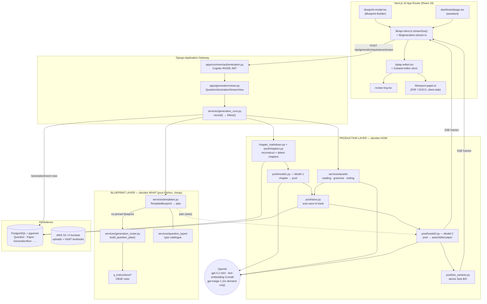
```mermaid
flowchart TB
    subgraph Client["Next.js 16 App Router (React 19)"]
        BB["blueprint-modal.tsx<br/>(Blueprint Builder)"]
        CHAT["dashboard/page.tsx<br/>(assistant)"]
        SSE_C["lib/api-client.ts streamSse()<br/>+ lib/generation-stream.ts"]
        ED["tiptap-editor.tsx<br/>+ Zustand editor-store"]
        RT["review-tray.tsx"]
        EX["lib/export-paper.ts<br/>(PDF / DOCX, client-side)"]
    end

    subgraph Gateway["Django Application Gateway"]
        AUTH["apps/common/authentication.py<br/>Cognito RS256 JWT"]
        VIEW["apps/generation/views.py<br/>QuestionGenerationStreamView"]
        RUNS["services/generation_runs.py<br/>record() → follow()"]
    end

    subgraph Blueprint["BLUEPRINT LAYER — decides WHAT (pure Python, cheap)"]
        TPL["services/templates.py<br/>TemplateBlueprint → plan"]
        ROUTER["services/generation_router.py<br/>build_question_plan()"]
        QINST["q_instructions/*<br/>CBSE rules"]
        QT["services/question_types/<br/>type catalogue"]
    end

    subgraph Production["PRODUCTION LAYER — decides HOW"]
        CH["chapter_markdown.py + pool/chapters.py<br/>reconstruct + detect chapters"]
        AS["services/assets/<br/>reading · grammar · writing"]
        M1["pool/model1.py — Model 1<br/>chapter → pool"]
        STORE["pool/store.py<br/>auto-save to bank"]
        M2["pool/model2.py — Model 2<br/>pool → assembled paper"]
        VAR["pool/set_variants.py<br/>derive Sets B/C"]
    end

    subgraph Data["Persistence"]
        PG[("PostgreSQL + pgvector<br/>Question · Paper · GenerationRun · …")]
        S3[("AWS S3 ×2 buckets<br/>uploads + HSAT textbooks")]
    end

    OAI(("OpenAI<br/>gpt-4.1-mini · text-embedding-3-small<br/>gpt-image-1 (on demand only)"))

    BB --> SSE_C
    CHAT --> SSE_C
    SSE_C -->|"POST /api/generation/questions/stream"| AUTH --> VIEW --> RUNS
    RUNS --> TPL
    TPL -->|"no pinned blueprint"| ROUTER --> QINST
    TPL --- QT
    RUNS --> CH --> M1 --> STORE
    RUNS --> AS --> STORE
    STORE --> M2 --> VAR
    TPL -.->|"plan (slots)"| M2
    CH --> PG
    M1 --> OAI
    AS --> OAI
    M2 --> OAI
    STORE --> PG
    RUNS -->|"GenerationEvent rows"| PG
    VAR -->|"SSE frames"| SSE_C
    M2 -->|"SSE frames"| SSE_C
    SSE_C --> ED --> RT
    ED --> EX
```

**Reading the diagram.** A request enters through Cognito auth and hits the
stream view. The view starts a **run** on a background thread and returns a
response that *follows* that run. The pipeline first gets a plan, which is a
list of slots (the "what"). The Builder's pinned blueprint is authoritative.
Without one, the router compiles a plan from the CBSE rules. Each slot names
its **generator**. `question_pool` slots go through chapter reconstruction and
Model 1. English Reading, Grammar and Writing slots go to their own asset
generators, which are never handed the textbook. The merged pool is auto-saved
to the bank, and Model 2 *selects* the slots' questions from it. Model 2 is the
only place the "what" and the "how" meet.

### 2.2 The request lifecycle

This is the end-to-end sequence for a full generation
(`stream_pool_questions` in `services/pool/pipeline.py`, driven by
`services/generation_runs.py`). The pool is saved to the bank **before** the
paper is assembled. The bank keeps the *whole* pool, not just the questions this
paper used.

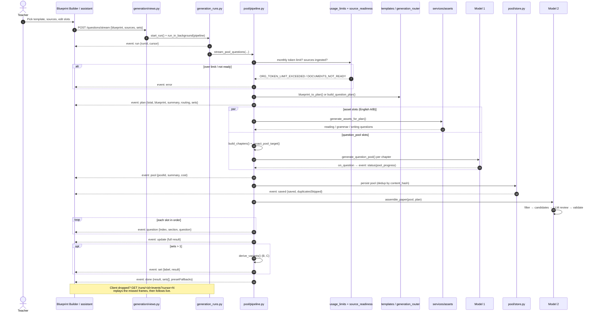
```mermaid
sequenceDiagram
    autonumber
    actor T as Teacher
    participant FE as Blueprint Builder / assistant
    participant V as generation/views.py
    participant R as generation_runs.py
    participant P as pool/pipeline.py
    participant GATE as usage_limits + source_readiness
    participant BP as templates / generation_router
    participant AS as services/assets
    participant M1 as Model 1
    participant ST as pool/store.py
    participant M2 as Model 2

    T->>FE: Pick template, sources, edit slots
    FE->>V: POST /questions/stream {blueprint, sources, sets}
    V->>R: start_run() + run_in_background(pipeline)
    R-->>FE: event: run {runId, cursor}
    R->>P: stream_pool_questions(...)
    P->>GATE: monthly token limit? sources ingested?
    alt over limit / not ready
        GATE-->>P: ORG_TOKEN_LIMIT_EXCEEDED / DOCUMENTS_NOT_READY
        P-->>FE: event: error
    end
    P->>BP: blueprint_to_plan() or build_question_plan()
    P-->>FE: event: plan {total, blueprint, summary, routing, sets}
    par asset slots (English A/B)
        P->>AS: generate_assets_for_plan()
        AS-->>P: reading / grammar / writing questions
    and question_pool slots
        P->>P: build_chapters() + _exact_pool_target()
        P->>M1: generate_question_pool() per chapter
        M1-->>P: on_question → event: status(pool_progress)
    end
    P-->>FE: event: pool {poolId, summary, cost}
    P->>ST: persist pool (dedup by content_hash)
    ST-->>FE: event: saved {saved, duplicatesSkipped}
    P->>M2: assemble_paper(pool, plan)
    M2->>M2: filter → candidates → LLM review → validate
    loop each slot in order
        P-->>FE: event: question {index, section, question}
    end
    P-->>FE: event: update {full result}
    opt sets > 1
        P->>P: derive_variants() (B, C)
        P-->>FE: event: set {label, result}
    end
    P-->>FE: event: done {result, sets[], presetFallbacks}
    Note over FE,R: Client dropped? GET /runs/<id>/events?cursor=N<br/>replays the missed frames, then follows live.
```

### 2.3 The blueprint resolution sequence

When no pinned blueprint is submitted (a CBSE card that was not edited), the
Blueprint Layer resolves subject structure *deterministically*. Social Science
is the most instructive example. CBSE splits it into four sub-streams
(History, Geography, Civics, Economics) with asymmetric rules: History carries
the case-study slots, Economics forbids certain question types, and OR-choices
land on specific mark bands. All of this is Python, not an LLM prompt.

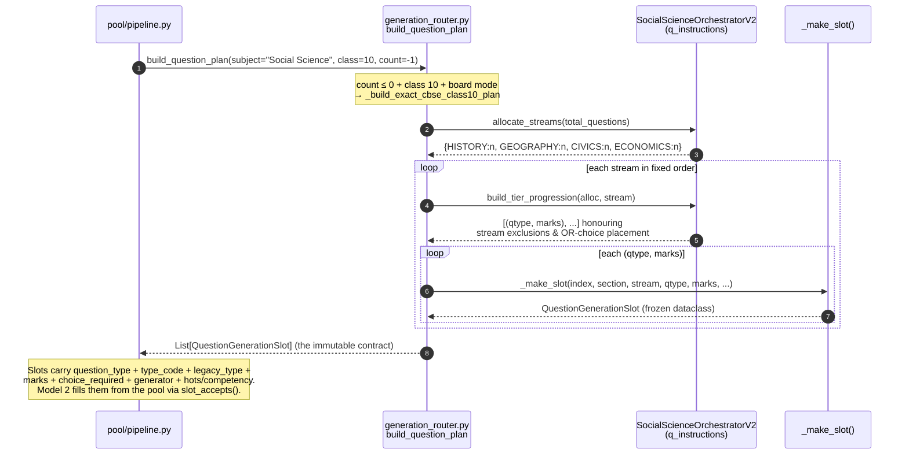
```mermaid
sequenceDiagram
    autonumber
    participant P as pool/pipeline.py
    participant R as generation_router.py<br/>build_question_plan
    participant O as SocialScienceOrchestratorV2<br/>(q_instructions)
    participant SLOT as _make_slot()

    P->>R: build_question_plan(subject="Social Science", class=10, count=-1)
    Note over R: count ≤ 0 + class 10 + board mode<br/>→ _build_exact_cbse_class10_plan
    R->>O: allocate_streams(total_questions)
    O-->>R: {HISTORY:n, GEOGRAPHY:n, CIVICS:n, ECONOMICS:n}
    loop each stream in fixed order
        R->>O: build_tier_progression(alloc, stream)
        O-->>R: [(qtype, marks), ...] honouring<br/>stream exclusions & OR-choice placement
        loop each (qtype, marks)
            R->>SLOT: _make_slot(index, section, stream, qtype, marks, ...)
            SLOT-->>R: QuestionGenerationSlot (frozen dataclass)
        end
    end
    R-->>P: List[QuestionGenerationSlot]  (the immutable contract)
    Note over P: Slots carry question_type + type_code + legacy_type +<br/>marks + choice_required + generator + hots/competency.<br/>Model 2 fills them from the pool via slot_accepts().
```

The output of this layer is a list of **`QuestionGenerationSlot`** frozen
dataclasses (`services/generation_router.py:63`). Each slot is *"a deterministic,
pre-LLM contract for exactly one generated question"*. It holds the index,
section title, subject, stream, `question_type` (the runtime shape), `type_code`
(the catalogue type, §10), coarse `legacy_type`, marks, difficulty,
`choice_required`, `requires_figure`, `generator` / `asset_type` (which
producer owns it, §11.2), and the `hots` / `competency` attributes. The LLM may
write *wording*; it never decides counts, marks, sections, or routing. That
makes the paper's structural correctness a property of the code rather than a
hope about the model.

---

## 3. Comprehensive File & Folder Directory

```
qp-gen/
├── README.md                    ← this document
├── CLAUDE.md                    ← agent working notes
├── SECURITY_AUDIT.md
├── docs/                        ← audits, work queue, handoffs, manual test checklist
├── deployment/                  ← nginx, gunicorn + retention systemd units, migration runbook
│
├── backend/                     ← Django 5 + DRF API
│   ├── manage.py
│   ├── requirements.txt
│   ├── config/                  ← settings (ALL env-driven config), urls, wsgi/asgi
│   │
│   ├── apps/                    ← Django apps (thin — HTTP + models only)
│   │   ├── accounts/            ← User, BrandKit, BrandAsset; profile, brand kit, admin user approval
│   │   ├── chat/                ← Conversation, ChatMessage — the dashboard assistant
│   │   ├── common/              ← auth, permissions, PortableArrayField, serve_media, SQLite pragmas
│   │   ├── documents/           ← PdfSource, HsatSource, DocumentChunk; upload + HSAT views
│   │   ├── generation/          ← stream + runs views, templates/design views,
│   │   │                          GenerationRun/Event, PaperTemplate, TemplateFolder, ApiUsage
│   │   ├── organizations/       ← Organization, Membership, OrganizationInvite; usage + analytics
│   │   ├── projects/            ← Project, Paper (soft delete), PaperSet, Draft, Question,
│   │   │                          QuestionType/Family/Alias, ExportRecord
│   │   ├── question_generation/ ← DORMANT refactored blueprint engine (flag off) + OpenAIProvider
│   │   └── storage/             ← export upload / download-URL endpoints
│   │
│   ├── services/                ← the actual business logic (fat services, thin apps)
│   │   ├── generation_router.py ← BLUEPRINT compiler: build_question_plan
│   │   ├── templates.py         ← TemplateBlueprint, slot menu, blueprint_to_plan
│   │   ├── template_catalog.py  ← built-in cards (CBSE, starters, Describe It Yourself)
│   │   ├── starter_templates.py ← hand-written class starters (Classes 1–9)
│   │   ├── paper_design.py      ← prose → validated paper design
│   │   ├── generation_runs.py   ← durable runs: record() / follow()
│   │   ├── chat_service.py      ← dashboard assistant (conversation, never generation)
│   │   ├── question_image.py    ← one gpt-image-1 picture per teacher click
│   │   ├── chapter_markdown.py  ← reconstruct a chapter as Markdown from chunks
│   │   ├── document_service.py  ← PDF/DOCX upload → chunk → embed (ingestion)
│   │   ├── ocr_service.py       ← vision OCR for thin-text (scanned) pages
│   │   ├── subject_detection_service.py / pdf_analysis_service.py / pdf_validation_service.py
│   │   ├── ingest_concurrency.py← one global cap on concurrent chapter ingests
│   │   ├── semantic_pipeline.py ← header/footer strip + chapter-aware chunking
│   │   ├── chunking_service.py  ← plain overlapping-window chunker (fallback path)
│   │   ├── embedding_service.py / retrieval_service.py ← pgvector RAG (answer scripts only)
│   │   ├── source_readiness.py  ← authoritative "is this upload ingested?" gate
│   │   ├── answer_script_service.py ← CBSE marking-scheme generator
│   │   ├── draft_service.py     ← server copy of unsaved drafts (last-write-wins)
│   │   ├── brand_kit.py / organization_logo.py ← logo storage + URL minting
│   │   ├── usage_limits.py / usage_pricing.py  ← monthly token cap, tokens → INR
│   │   ├── cognito_service.py / email_service.py
│   │   ├── openai_service.py    ← shared OpenAI client, usage recording
│   │   ├── content_filters.py / language_validation.py
│   │   ├── media_urls.py / s3_client.py / paper_content_service.py
│   │   ├── hsat_service.py / hsat_catalog.py ← shared textbook catalogue + ingest
│   │   ├── syllabus_scope.py    ← off-syllabus exclusions, Bloom bias, Maths bands
│   │   │
│   │   ├── question_types/      ← ★ the type catalogue (Django-free) ★
│   │   ├── figures/             ← deterministic SVG charts: extract spec → render
│   │   ├── assets/              ← reading / grammar / writing generators (English)
│   │   └── pool/                ← ★ THE PRODUCTION LAYER ★
│   │       ├── pipeline.py       ← stream_pool_questions (SSE orchestrator)
│   │       ├── chapters.py       ← chapter detection + oversized-chapter splitting
│   │       ├── recipes.py        ← Model 1 batches, derived from the plan
│   │       ├── model1.py         ← Model 1: chapter Markdown → pool
│   │       ├── structure.py      ← stimulus + parts, marks must add up
│   │       ├── streaming.py      ← incremental JSON-object stream extractor
│   │       ├── schema.py         ← PoolQuestion contract + normalisation + slot_accepts
│   │       ├── store.py          ← persist pool to bank + load bank + dedup
│   │       ├── model2.py         ← Model 2: 5-stage selection (solver + LLM review)
│   │       ├── set_variants.py   ← derive Sets B/C from a master paper
│   │       ├── from_bank.py      ← assemble a paper from saved questions (skip Model 1)
│   │       ├── replace.py        ← regenerate exactly one question
│   │       ├── keepalive.py      ← SSE ": ping" + exceptions → error frames
│   │       ├── gim.py            ← legacy regex General Instructions parser
│   │       └── rendering.py      ← printable content (OR-labels)
│   │
│   ├── q_instructions/          ← LIVE blueprint rules engine (used by generation_router)
│   └── utils/ids.py             ← generate_id() (32-char ids, Prisma-compatible)
│
└── frontend/                    ← Next.js 16 (App Router / Turbopack), React 19
    ├── next.config.ts           ← pins Turbopack root; old-route redirects; build-time API URL guard
    ├── app/
    │   ├── page.tsx             ← landing
    │   ├── (auth)/              ← login, register, forgot/reset password, onboard
    │   └── (dashboard)/         ← dashboard, editor, papers, questions, templates,
    │                              settings, admin, admin/organizations/[id]
    ├── components/
    │   ├── blueprint/           ← Blueprint Builder: modal, template grid, sources, slot editor
    │   ├── editor/              ← toolbar, outline, hover menu, swap / figure / bank dialogs,
    │   │   └── extensions/      ← TipTap nodes: page, pagination engine, header, math, float image, OR-groups
    │   ├── templates/           ← template manager: folder rail, cards, editor panel
    │   ├── admin/               ← members, invites, domains, roster, usage analytics
    │   ├── dashboard/           ← assistant backdrop, follow-up card, press check
    │   ├── question-type-picker.tsx
    │   ├── tiptap-editor.tsx    ← the WYSIWYG paper editor
    │   ├── review-tray.tsx / comparison-workspace.tsx / school-switcher.tsx
    ├── lib/
    │   ├── api-client.ts        ← streamSse() + REST wrappers + token refresh
    │   ├── generation-stream.ts ← the one shared reading of the SSE contract
    │   ├── use-paper-generation.ts ← editor's generation hook (runs + reattach)
    │   ├── export-paper.ts      ← the one export path → export-pdf.ts / export-docx.ts
    │   ├── live-document-db.ts / drafts.ts / drafts-sync.ts ← IndexedDB docs + server sync
    │   ├── question-types.generated.ts ← generated from the backend catalogue; do not edit
    │   └── cognito-client.ts / auth-client.ts / organizations-client.ts
    ├── scripts/                 ← node self-check scripts (test-*.mjs)
    └── store/editor-store.ts    ← Zustand store (UI state persisted to localStorage)
```

---

## 4. Technology Stack

| Concern | Choice | Why |
|---|---|---|
| Backend framework | **Django 5.0 + DRF 3.15** | Mature ORM over a pre-existing Prisma schema; DRF for the auth/permission stack. |
| Database | **PostgreSQL + pgvector 0.2.5** (SQLite for local dev/tests) | Relational bank + 1536-dim embedding column in one store. SQLite runs in WAL mode with a busy timeout (`apps/common/db_pragmas.py`) so concurrent ingests don't lock. |
| LLM provider | **OpenAI** (`openai` 2.41) | `gpt-4.1-mini` for Models 1 & 2, assets, chat, OCR and figure specs; `gpt-image-1` for on-demand pictures; `text-embedding-3-small` for retrieval. |
| PDF | **PyMuPDF**, pypdf, python-docx | Text + page rendering for OCR. |
| Auth | **AWS Cognito** (RS256 JWT, PyJWT + cryptography) | Managed user pool; backend validates tokens against pool JWKS. |
| Object storage | **AWS S3 ×2** (`django-storages` + raw boto3) | Uploads/images bucket + read-only HSAT textbook bucket, possibly in different regions. |
| Cache | **Redis (optional) / LocMemCache** | Shared cache for multi-instance deploys; degrades to per-process LocMem. |
| App server | **gunicorn gthread** (3 workers × 4 threads, 600s timeout) | A generation holds a worker for minutes. |
| Frontend | **Next.js 16.2 (App Router, Turbopack) + React 19.2 + Tailwind 4** | Route groups, fast dev. |
| Editor | **TipTap 3.23** (ProseMirror) + KaTeX | Custom NodeViews for A4 pages, header, math, float images, OR-groups. |
| Client state | **Zustand** + **TanStack Query** + **IndexedDB** | UI state in localStorage; documents in IndexedDB (too big for localStorage); server state via Query. |
| Charts / motion | **Recharts** (admin usage), **framer-motion** | |
| Export | **html2canvas + jsPDF**, **docx** | 100% client-side PDF/DOCX. There is no server-side export. |

---

## 5. The Persistence Layer & Data Model

The schema is **pre-existing** (originally created by Prisma). This hard
constraint explains several oddities in the migrations: capitalised `db_table`
names (`Project`, `Paper`, `Question`, `ExportRecord`) and camelCase columns
(`userId`, `contentHash`, `poolId`, `deletedAt`). New Django models match this
convention rather than fighting it.

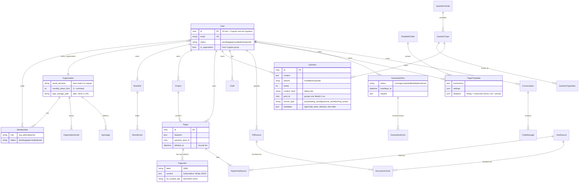
```mermaid
erDiagram
    Organization ||--o{ Membership : has
    User ||--o{ Membership : holds
    Organization ||--o{ OrganizationInvite : issues
    User }o--|| Organization : "active_organization"
    User ||--o| BrandKit : owns
    BrandKit ||--o{ BrandAsset : holds
    User ||--o{ Project : owns
    User ||--o{ Paper : owns
    User ||--o{ Question : owns
    User ||--o{ Draft : has
    User ||--o{ PdfSource : uploads
    User ||--o{ PaperTemplate : saves
    TemplateFolder ||--o{ PaperTemplate : groups
    User ||--o{ GenerationRun : starts
    GenerationRun ||--o{ GenerationEvent : "records frames"
    User ||--o{ Conversation : chats
    Conversation ||--o{ ChatMessage : contains
    Organization ||--o{ ApiUsage : "billed to"
    Project ||--o{ Paper : contains
    Paper ||--o{ PaperSet : "has sets (A/B/C)"
    Paper ||--o{ PaperHsatSource : links
    HsatSource ||--o{ PaperHsatSource : "linked by"
    PdfSource ||--o{ DocumentChunk : "chunked into"
    HsatSource ||--o{ DocumentChunk : "chunked into"
    QuestionFamily ||--o{ QuestionType : classifies
    QuestionType ||--o{ QuestionTypeAlias : "known as"
    QuestionType ||--o{ Question : types

    User {
        char id PK "32-hex = Cognito sub w/o hyphens"
        string email UK
        string status "pending|approved|admin|rejected"
        bool is_superadmin "from Cognito group"
    }
    Membership {
        string role "org_admin|teacher"
        string status "pending|approved|rejected"
    }
    Organization {
        string email_domains "auto-match on signup"
        int monthly_token_limit "0 = unlimited"
        string logo_storage_path "path, never a URL"
    }
    Question {
        char id PK
        text content
        array options "PortableArrayField"
        int marks
        string content_hash "dedup key"
        char pool_id "groups one Model-1 run"
        string source_type "pool|reading_asset|grammar_asset|writing_asset|..."
        json metadata "typeCode, parts, stimulus, slot index"
    }
    Paper {
        char id PK
        json blueprint
        char question_pool_id
        datetime deleted_at "recycle bin"
    }
    PaperSet {
        string label "A|B|C"
        text content "authoritative TipTap JSON"
        string s3_content_key "best-effort mirror"
    }
    GenerationRun {
        string status "running|completed|failed|abandoned"
        datetime heartbeat_at
        json request
    }
    PaperTemplate {
        text instructions
        json settings
        json blueprint "empty = instruction-driven; set = pinned"
    }
```

**Load-bearing details:**

- **`Question.options` is a `PortableArrayField`** (`apps/common/fields.py`),
  not a plain `ArrayField`. It is a Postgres `text[]` in production but
  round-trips as JSON on SQLite, so the auto-save path is testable. It
  *deconstructs as `ArrayField`*, so `makemigrations` sees no change and never
  tries to ALTER the live table.
- **`content_hash` is a plain index, not a UNIQUE constraint.** The live table
  predates the pool and may already hold duplicates, so a unique index could
  not be built over it. Dedup is enforced in application code (`pool/store.py`).
- **`pool_id`** groups every question from one Model 1 run, so a different paper
  can be generated from the same pool without re-running Model 1.
- **A `DocumentChunk` belongs to exactly one of** `PdfSource` (user upload) or
  `HsatSource` (shared textbook). Both live in one table so retrieval treats them
  as one pool.
- **Question types are seeded from a frozen snapshot** (migration 0016,
  `apps/projects/migrations/data/`). `QuestionTypeAlias` keeps every old code
  readable forever (§10).
- **Papers are soft-deleted.** `Paper.deleted_at` puts a paper in the recycle
  bin. It can be restored for `PAPER_TRASH_RETENTION_DAYS` (30), and then
  `purge_deleted_papers` removes it.
- **Drafts live in two places.** The editor writes every keystroke to IndexedDB;
  `Draft` is a debounced server copy, ordered **last-write-wins on the client's
  clock**, so work started on one device can be finished on another
  (`services/draft_service.py`). Both copies expire after
  `DRAFT_RETENTION_DAYS` (10), and the frontend constant must match.
- **`GenerationRun` / `GenerationEvent` are a delivery mechanism, not history.**
  They are kept for `GENERATION_RUN_RETENTION_DAYS` (7).

---

## 6. Subsystem: Authentication, Organizations & Usage

### 6.1 Authentication

**AWS Cognito, Path A (a public app client with *no* secret).** The frontend
performs the Cognito login (SRP) via `lib/cognito-client.ts` and sends the
access token as a `Bearer` header. Tokens are **renewed before they expire**,
not after a 401. The backend validates that token itself against the pool's
JWKS and does not call Cognito on every request.

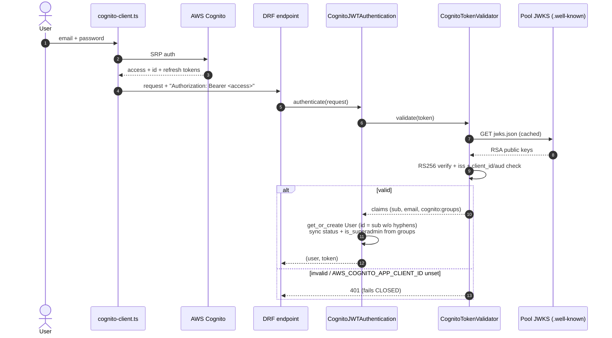
```mermaid
sequenceDiagram
    autonumber
    actor U as User
    participant FE as cognito-client.ts
    participant COG as AWS Cognito
    participant API as DRF endpoint
    participant AUTHN as CognitoJWTAuthentication
    participant VAL as CognitoTokenValidator
    participant JWKS as Pool JWKS (.well-known)

    U->>FE: email + password
    FE->>COG: SRP auth
    COG-->>FE: access + id + refresh tokens
    FE->>API: request + "Authorization: Bearer <access>"
    API->>AUTHN: authenticate(request)
    AUTHN->>VAL: validate(token)
    VAL->>JWKS: GET jwks.json (cached)
    JWKS-->>VAL: RSA public keys
    VAL->>VAL: RS256 verify + iss + client_id/aud check
    alt valid
        VAL-->>AUTHN: claims (sub, email, cognito:groups)
        AUTHN->>AUTHN: get_or_create User (id = sub w/o hyphens)<br/>sync status + is_superadmin from groups
        AUTHN-->>API: (user, token)
    else invalid / AWS_COGNITO_APP_CLIENT_ID unset
        VAL-->>API: 401 (fails CLOSED)
    end
```

**Why it fails closed.** `AWS_COGNITO_APP_CLIENT_ID` has **no hard-coded
default**. An earlier literal contained an `ℓ/1` typo that silently broke the
`client_id`/`aud` check and rejected every token. The fix was to make an unset
value reject all tokens rather than trust a wrong client. The value **must**
match the frontend's `NEXT_PUBLIC_AWS_COGNITO_APP_CLIENT_ID`. PyJWT needs the
`cryptography` package to build the RSA key. Without it, *every* authenticated
request fails with `Algorithm 'RS256' could not be found`.

**Groups drive status.** The `superadmin` Cognito group sets
`User.is_superadmin`. `superadmin`/`admin` → `status="admin"`, any other group →
`approved`, and none → `pending`. Status only ever ratchets up from the token,
and `rejected` is never overridden. New Cognito users are created with a
**UUID username**, and admin APIs address them by the **email alias**, never by
`sub`.

**Approval gating.** DRF's default permission is `IsApprovedOrAdmin`: a new
`pending` user is authenticated but not authorised until approved. Approval
comes from a platform admin, a school's admin, or a teacher invite link.

### 6.2 Organizations

`apps/organizations` turns the product from single-teacher into multi-school.

- **Organization** — a school's profile (address, GSTIN, crest, email domains,
  monthly token limit).
- **Membership** — `(user, organization, role ∈ {org_admin, teacher}, status)`.
  It is a ForeignKey, not a OneToOne: a teacher can belong to **several
  schools**. Which school they are acting as is `User.active_organization`,
  switched with `POST /api/organizations/switch` (`school-switcher.tsx`). It
  self-heals to the sole approved membership when unset.
- **OrganizationInvite** — a token bound to one email. Two kinds:
  - `org_admin`: issued by the superadmin. Accepting it **creates** a school
    (the `/onboard` page).
  - `teacher`: issued by a school's admin. Accepting it joins **already
    approved**, which is the only way a teacher skips the approval queue.
  Invites can be revoked, and acceptance checks that the caller's email matches
  the invite.
- **Email-domain matching** (`domains.py`) — a signup whose address matches a
  school's `email_domains` gets that school **pre-selected**. It is a hint, never
  an authorisation: the membership still starts pending, because domains are
  trivially spoofable at signup.
- **Bootstrap** — `python manage.py seed_superadmin`.

### 6.3 Usage limits & pricing

Every OpenAI call records an `ApiUsage` row billed to the user's
`billing_organization`. Billing applies even while a membership is pending, so
an unapproved member cannot bypass the cap. `check_monthly_token_limit` runs
before every spending endpoint: the stream, replace-question, the designer, the
assistant and answer scripts. When it trips, the endpoint returns
`ORG_TOKEN_LIMIT_EXCEEDED` with the month's usage **in rupees**.
`services/usage_pricing.py` converts tokens to INR from a built-in per-model
table. `MODEL_PRICING_USD_JSON` and `USD_TO_INR` correct it without a deploy.
Org admins see a usage summary, and the superadmin sees platform analytics
(`components/admin/usage-analytics.tsx`).

---

## 7. Subsystem: Document Ingestion

Uploading a PDF is decoupled from generation. `document_service.py` turns a file
into `DocumentChunk` rows and returns a `PdfSource` id *before* ingestion
finishes. The client polls a status endpoint, and the generation pipeline
independently re-verifies readiness (defence in depth).

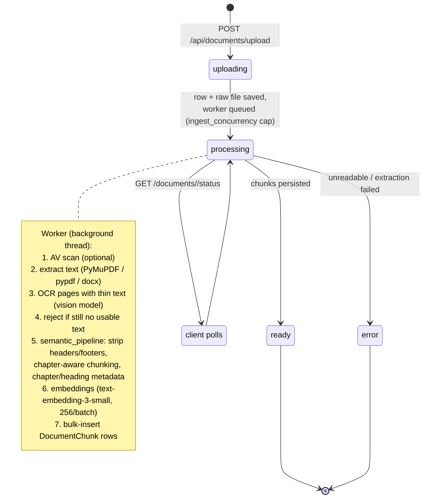
```mermaid
stateDiagram-v2
    [*] --> uploading: POST /api/documents/upload
    uploading --> processing: row + raw file saved,<br/>worker queued (ingest_concurrency cap)
    note right of processing
      Worker (background thread):
      1. AV scan (optional)
      2. extract text (PyMuPDF / pypdf / docx)
      3. OCR pages with thin text (vision model)
      4. reject if still no usable text
      5. semantic_pipeline: strip headers/footers,
         chapter-aware chunking, chapter/heading metadata
      6. embeddings (text-embedding-3-small, 256/batch)
      7. bulk-insert DocumentChunk rows
    end note
    processing --> ready: chunks persisted
    processing --> error: unreadable / extraction failed
    ready --> [*]
    error --> [*]

    state "client polls" as poll
    processing --> poll: GET /documents/<id>/status
    poll --> processing
```

**Before upload**, the client can call `detect-subject`, `analyze-pdf`
(analyses several PDFs together and extracts their metadata) and
`validate-metadata`. These warn when a chapter's subject fights the paper's
subject. **Duplicate uploads** are detected by SHA-256, and a ready source with
the same hash is reused instead of being ingested again
(`document_service._reusable_duplicate`).

**Scanned PDFs.** Phone scans have an empty text layer. Ingestion used to
accept them and build a "chapter" out of nothing but a figure list, and the
generator then asked which figure sat on which page. `ocr_service.py` now OCRs
**only** pages under `PDF_OCR_MIN_PAGE_CHARS`, capped at `PDF_OCR_MAX_PAGES`, so
digital PDFs still cost nothing. A document still below
`PDF_MIN_DOC_CHARS_PER_PAGE` after OCR is rejected at upload.

**Figure chunks are off by default** (`INGEST_EXTRACT_FIGURES=false`). Nothing
in the live pipeline reads them any more, because figures are drawn on demand
(§13). Turning them off saves one S3 PUT per figure on every ingest.

**One global ingest cap.** Both entry points (an upload and a library book)
hand work to daemon threads. `ingest_concurrency.py` bounds how many run at
once, so selecting fifteen chapters doesn't oversubscribe the DB, the OpenAI
rate limit and memory simultaneously.

**Two chunking paths, deliberately.** `semantic_pipeline.py` is the primary path
for PDFs. It removes repeated headers/footers (a line on ≥30% of pages), then
splits into **non-overlapping**, chapter-aware chunks that carry
`chapter`/`heading` metadata. The fallback, `chunking_service.chunk_text`
(DOCX, txt, degenerate PDFs), produces ~1000-char windows with 200-char overlap.
That is why chapter reconstruction (§8) trims overlap on one path and not the
other.

**Embeddings are optional for generation.** The pool pipeline reads chunk
*text* and never touches a vector. Embeddings serve only answer-script retrieval
and the dormant engine. `INGEST_EMBEDDINGS_ENABLED=false` makes ingestion purely
local.

Upload routes:

- `POST /api/documents/upload` — multipart; backend saves and processes.
- `POST /api/documents/presign` → direct-to-S3 → `POST /api/documents/confirm`.

Alongside user uploads, **HSAT sources** (`HsatSource`) are *shared, global*
textbook ingestions, one per `(grade, subject, book)`. A paper links to them via
`PaperHsatSource`. A library book can be **applied without waiting for it to
index**, and a chapter whose chunks are already stored is never re-read.

---

## 8. Subsystem: Chapter Reconstruction & Detection

Model 1 reads a **whole chapter** in one pass, so it needs the chapter as a
single coherent Markdown document. Ingestion discards the full text and keeps
only ~60-100 chunks. Rather than add a `markdown_content` column (a migration +
backfill + re-upload of every existing PDF), the system **reconstructs** the
document from the chunks that already exist. This works the same for old and
new rows, uploads and HSAT books.

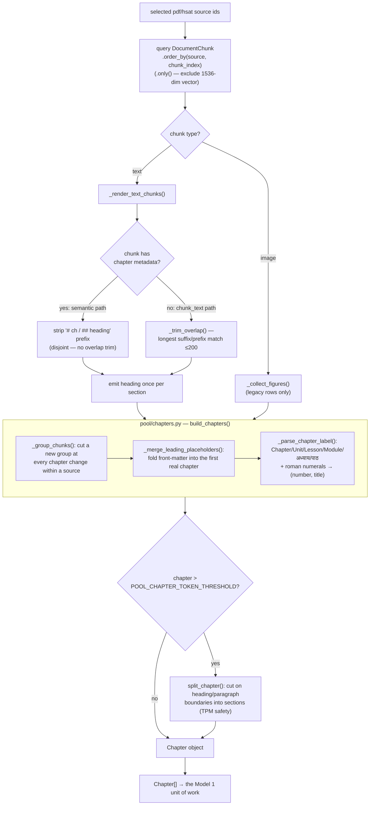
```mermaid
flowchart TB
    START["selected pdf/hsat source ids"] --> Q["query DocumentChunk<br/>.order_by(source, chunk_index)<br/>(.only() — exclude 1536-dim vector)"]
    Q --> SPLIT{"chunk type?"}
    SPLIT -->|image| FIG["_collect_figures()<br/>(legacy rows only)"]
    SPLIT -->|text| REND["_render_text_chunks()"]

    REND --> HASCH{"chunk has<br/>chapter metadata?"}
    HASCH -->|yes: semantic path| STRIP["strip '# ch / ## heading' prefix<br/>(disjoint — no overlap trim)"]
    HASCH -->|no: chunk_text path| TRIM["_trim_overlap() —<br/>longest suffix/prefix match ≤200"]
    STRIP --> EMIT["emit heading once per section"]
    TRIM --> EMIT

    subgraph DETECT["pool/chapters.py — build_chapters()"]
        GRP["_group_chunks(): cut a new group at<br/>every chapter change within a source"]
        MERGE["_merge_leading_placeholders():<br/>fold front-matter into the first real chapter"]
        LABEL["_parse_chapter_label():<br/>Chapter/Unit/Lesson/Module/अध्याय/पाठ<br/>+ roman numerals → (number, title)"]
        GRP --> MERGE --> LABEL
    end

    EMIT --> DETECT
    FIG --> DETECT
    DETECT --> OVERS{"chapter ><br/>POOL_CHAPTER_TOKEN_THRESHOLD?"}
    OVERS -->|yes| SEC["split_chapter(): cut on heading/paragraph<br/>boundaries into sections (TPM safety)"]
    OVERS -->|no| CHAP["Chapter object"]
    SEC --> CHAP
    CHAP --> OUT["Chapter[] → the Model 1 unit of work"]
```

**The unit of generation is a chapter, never a file and never the whole
upload.** `build_chapters` handles several single-chapter PDFs, one textbook
with many chapters, or a mix. Boundaries come from *content* metadata, not
filenames. An oversized chapter is split into sections so no single Model 1
request can breach the tokens-per-minute (TPM) ceiling. The section pools are
merged back under the parent chapter title.

A `Chapter` carries **provenance** (source PDF name and page span), and that is
stamped onto every generated question's metadata.

---

## 9. Subsystem: Templates & the Blueprint Engine

This is the "what" layer. Since August it has **one front door: the
template.**

### 9.1 Templates replace "QP Type"

There used to be two modes that behaved like different products. *Board mode*
compiled a CBSE blueprint, and *General Instructions mode* asked a model to
design one from prose. A teacher had to pick a box before saying what they
wanted. Now both are templates, and every template is editable
(`services/templates.py`).

```mermaid
flowchart LR
    subgraph Catalog["template_catalog.py (built-in, listed lazily)"]
        CBSE["CBSE Sample Paper cards<br/>(derived from _NEW_ENGINE_ELIGIBILITY)"]
        START["Class starters 1–9<br/>(starter_templates.py)"]
        DIY["Describe It Yourself"]
    end
    SAVED["PaperTemplate (saved)<br/>+ TemplateFolder"]
    BRIEF["teacher's prose"] --> DES["paper_design.py<br/>model designs → Python validates"]
    DIY --> DES
    CBSE -->|resolve_builtin()| TB
    START --> TB
    DES --> TB
    SAVED --> TB
    TB["TemplateBlueprint (slots)"] --> BUILDER["Blueprint Builder<br/>(teacher edits slots)"]
    BUILDER -->|"payload.blueprint"| PLAN["blueprint_to_plan() → slots → pipeline"]
```

- **Built-in cards are generated, not typed out.** The CBSE cards are derived
  from the router's eligibility matrix, so adding a class to the engine adds its
  card for free. Listing stays cheap because a card is a *promise* of a
  blueprint, compiled on demand by `resolve_builtin()`.
- **Class starters** (`starter_templates.py`) are the one hand-written list:
  15 papers for Classes 1–9, built from catalogue types those classes are
  actually set. The picker shows them first under "Recommended for Class N".
- **Two kinds of saved template.** An *instruction-driven* template (no
  `blueprint`) is re-resolved from its instructions each time, so "Weekly Test"
  applied to next week's chapter produces next week's paper. A *pinned* template
  (has `blueprint`) is authoritative. A template becomes pinned the moment a slot
  is edited.
- **Slot source.** Each slot is `generate` or `saved` (fill from the bank), and
  the Builder's whole-paper ratio is just a bulk edit over slots.
- **Designer** (`paper_design.py`). Free prose ("weekly test on photosynthesis,
  mostly recall, 20 marks, half an hour") goes through one structured model
  call. Python validates and corrects the result, and `POST templates/resolve`
  also returns **detected settings** (subject, class, …) and design notes,
  which the Builder shows as receipt chips. Catalogue types the teacher names
  ("odd one out", "letter writing") are kept, not flattened to MCQ.
- **Template manager** (`/templates`) adds folders, in-place edits, fork,
  duplicate and blank templates.

### 9.2 Routing & eligibility (unedited CBSE cards)

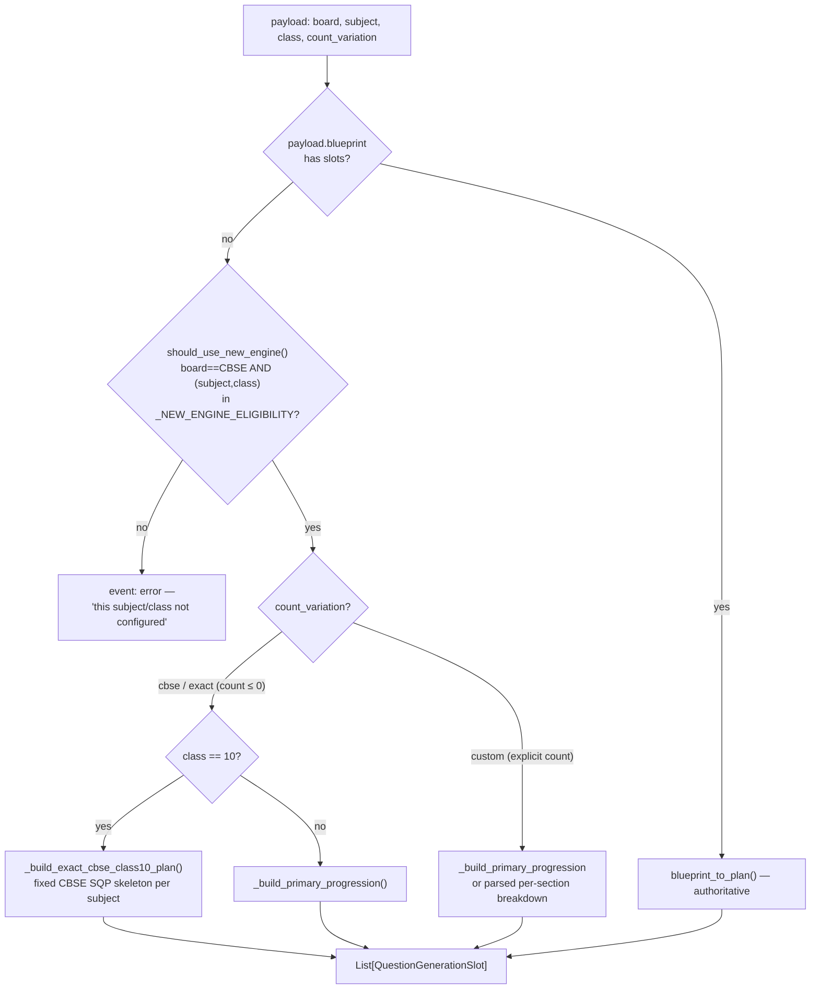
```mermaid
flowchart TD
    REQ["payload: board, subject, class, count_variation"] --> PIN{"payload.blueprint<br/>has slots?"}
    PIN -->|yes| BP["blueprint_to_plan() — authoritative"]
    PIN -->|no| ELIG{"should_use_new_engine()<br/>board==CBSE AND (subject,class)<br/>in _NEW_ENGINE_ELIGIBILITY?"}
    ELIG -->|no| ERR["event: error —<br/>'this subject/class not configured'"]
    ELIG -->|yes| MODE{"count_variation?"}
    MODE -->|"cbse / exact (count ≤ 0)"| BOARD{"class == 10?"}
    MODE -->|"custom (explicit count)"| CUSTOM["_build_primary_progression<br/>or parsed per-section breakdown"]
    BOARD -->|yes| EXACT["_build_exact_cbse_class10_plan()<br/>fixed CBSE SQP skeleton per subject"]
    BOARD -->|no| PRIMARY["_build_primary_progression()"]
    EXACT --> SLOTS
    PRIMARY --> SLOTS
    CUSTOM --> SLOTS["List[QuestionGenerationSlot]"]
    BP --> SLOTS
```

Eligibility (`_NEW_ENGINE_ELIGIBILITY`): Science & Social Science for **classes
1–10**; Mathematics, English, Hindi, Telugu for **class 10**. Subject aliases
(`maths`→`mathematics`, `sst`→`social science`, codes 041/241, etc.) are
normalised first.

### 9.3 The engine question (open)

There are **three** generation codebases:

- `q_instructions/` (~14k lines) — **live**; `generation_router` imports its
  facade.
- `services/pool/` (~9k lines) — **live**; the pipeline that writes papers.
- `apps/question_generation/` (~3.7k lines) — **dormant**. It is a refactored
  blueprint engine behind `QG_NEW_ENGINE_ENABLED` (default `false`), has no
  production caller, and ships a parity test against `q_instructions`. Its only
  runner is the management command `run_engine_slice` (formerly a test HTTP
  endpoint).

The pool pipeline's LLM seam
(`apps/question_generation/infrastructure/providers/openai_provider.py`,
`OpenAIProvider` / `LLMRequest` / `LLMMessage`) lives inside the dormant app but
**is used unconditionally**. Finishing the migration or deleting the dormant
engine is an open decision (`docs/feature-audit.md`).

---

## 10. Subsystem: The Question Type Catalogue

`services/question_types/` is the single answer to "what type is this?" for
every type string the product has ever stored. It is Django-free, so the pool,
the blueprint engine, migrations and tests can all import it. See its
[`README`](backend/services/question_types/README.md) and
[`docs/question-type-catalogue-plan.md`](docs/question-type-catalogue-plan.md).

**Two names for every type:**

| Name | Example | Used for |
|---|---|---|
| **Catalogue code** | `MCQ_ODD_ONE_OUT` | Identity. Slots store it as `typeCode`, bank rows in `metadata.typeCode`, editor blocks as `data-type-code`. |
| **Shape** | `MCQ` | One of 22 runtime codes. Decides option handling, `slot_accepts`, token budgets, editor layout and set variants. |

`schema.normalize_type` still returns the shape, so every `== "MCQ"` check
holds. Old strings resolve forever through the alias index. **HOTS** and
**COMPETENCY** are slot *attributes* now, not types.

**What an entry decides downstream:**

- **Generation.** A non-default type adds its brief, example and option rule to
  Model 1's batch, so board papers are prompted byte-identically to before. An
  `original`-lane type with a route is written by an asset generator.
- **Assembly.** Model 2 prefers the exact type (±12 score). When the pool lacks
  it, a slot is filled from the same shape and counted in `presetFallbacks`
  (sent on `done`, not yet shown in the UI).
- **Structure.** Container types return a stimulus plus parts (§11.3), and
  chart stimuli are drawn by `services/figures` (§13).
- **Picker.** `components/question-type-picker.tsx` shows a Suggested list per
  class and subject, ranked by subject weights, with search and browse across
  everything. Types that need a printed picture are listed but disabled, and a
  dot flags a type usually set to other classes.
- **Answer keys.** `answer_script_service._answer_format` picks the format a
  type needs (true/false, fill-in, matching, multi-correct, grammar, writing).

**Adding a type:** edit its family module under `catalog/` → run
`python manage.py export_question_types` to regenerate
`frontend/lib/question-types.generated.ts`. A test fails while it is stale. For
a DB change, write a new data migration from a new snapshot and never rewrite an
applied one.

---

## 11. Subsystem: The Pool Pipeline

This is the production layer — `services/pool/` plus `services/assets/`,
orchestrated by `stream_pool_questions` (`pipeline.py`).

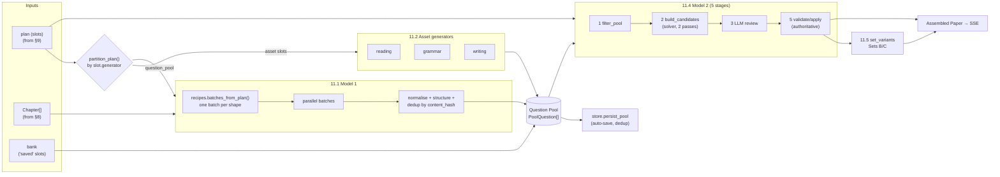
```mermaid
flowchart LR
    subgraph In["Inputs"]
        BP["plan (slots)<br/>(from §9)"]
        CH["Chapter[]<br/>(from §8)"]
        BANK["bank<br/>('saved' slots)"]
    end

    PART{"partition_plan()<br/>by slot.generator"}

    subgraph AS["11.2 Asset generators"]
        RD["reading"]
        GR["grammar"]
        WR["writing"]
    end

    subgraph M1["11.1 Model 1"]
        REC["recipes.batches_from_plan()<br/>one batch per shape"]
        BATCH["parallel batches"]
        DEDUP["normalise + structure +<br/>dedup by content_hash"]
    end

    POOL[("Question Pool<br/>PoolQuestion[]")]
    SAVE["store.persist_pool<br/>(auto-save, dedup)"]

    subgraph M2["11.4 Model 2 (5 stages)"]
        S1["1 filter_pool"]
        S2["2 build_candidates<br/>(solver, 2 passes)"]
        S3["3 LLM review"]
        S5["5 validate/apply<br/>(authoritative)"]
        S1-->S2-->S3-->S5
    end

    VAR["11.5 set_variants<br/>Sets B/C"]

    BP --> PART
    PART -->|asset slots| AS --> POOL
    PART -->|question_pool| M1
    CH --> M1
    REC --> BATCH --> DEDUP --> POOL
    BANK --> POOL
    POOL --> SAVE
    POOL --> M2
    BP --> M2
    S5 --> VAR
    S5 --> PAPER["Assembled Paper → SSE"]
    VAR --> PAPER
```

**No images are produced during generation.** The stage between Model 1 and
Model 2 that reused chapter figures or drew new ones with `gpt-image-1` has been
removed, along with `image_model.py`. It was ~85% of a paper's cost and drew
figures nobody asked for. `DIAGRAM` remains a question *type*: "draw a labelled
diagram of the eye" is answered by the student and needs no printed figure.
Model 1 is told never to refer to a figure the paper does not print. Questions
banked before the change keep their images. Figures are now added per question
in the editor (§13).

### 11.1 Model 1 — chapter → pool

`model1.py::generate_question_pool`. The old path issued one retrieval + one LLM
call per slot (38 calls, each seeing only its four retrieved chunks). Model 1
reads the **entire chapter once per batch**, which is ~10× cheaper and covers
the chapter evenly.

**Pool size is exact plus spares** (`pipeline._exact_pool_target`). This
replaced a fixed pool of 80–90. With the Builder, the teacher has already
decided what each slot is, so writing 90 questions to place 38 paid for 52
nobody asked for. The target is:

- **one per generated slot**,
- **+1 per `choice_required` slot** (a CBSE "OR" is a second question),
- **+ variant spares** only when Sets B/C are requested,
- **+ `POOL_EXACT_MARGIN_PERCENT`** (15%), because normalisation drops malformed
  and duplicate objects. A paper silently three questions short is worse than a
  few unused questions, and the spares are banked anyway.

**Batches come from the plan** (`recipes.batches_from_plan`). There is one batch
per distinct `(type, marks, asset_type, …)` shape, so the pool is guaranteed to
hold every shape the blueprint asks for. Each batch carries the `instruction_hint`s
of the slots that produced it. The fixed per-subject recipes remain as the
fallback when there is no plan.

**Prompt ordering is load-bearing** (`_build_request`): system prompt → **full
chapter** → small batch instruction. All batches share the enormous chapter
prefix, so putting the only varying part *last* lets OpenAI's automatic prefix
cache discount every batch after the first.

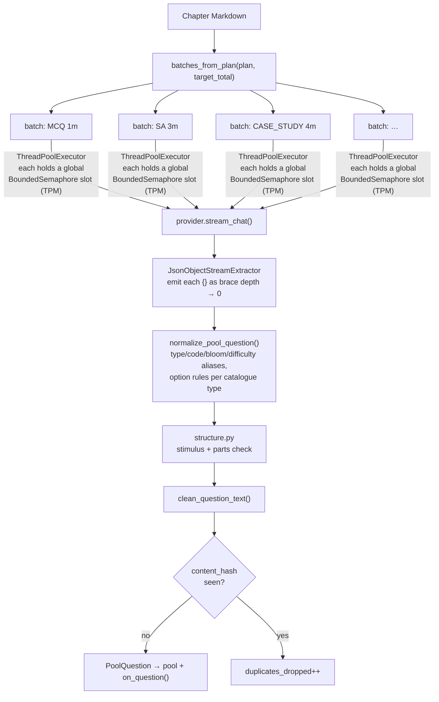
```mermaid
flowchart TB
    C["Chapter Markdown"] --> R["batches_from_plan(plan, target_total)"]
    R --> B1["batch: MCQ 1m"]
    R --> B2["batch: SA 3m"]
    R --> B3["batch: CASE_STUDY 4m"]
    R --> BN["batch: …"]
    B1 & B2 & B3 & BN -->|"ThreadPoolExecutor<br/>each holds a global<br/>BoundedSemaphore slot (TPM)"| STREAM["provider.stream_chat()"]
    STREAM --> EXT["JsonObjectStreamExtractor<br/>emit each {} as brace depth → 0"]
    EXT --> NORM["normalize_pool_question()<br/>type/code/bloom/difficulty aliases,<br/>option rules per catalogue type"]
    NORM --> STRUCT["structure.py<br/>stimulus + parts check"]
    STRUCT --> CLEAN["clean_question_text()"]
    CLEAN --> HASH{"content_hash<br/>seen?"}
    HASH -->|no| KEEP["PoolQuestion → pool + on_question()"]
    HASH -->|yes| DROP["duplicates_dropped++"]
```

**Concurrency safety.** Chapters generate in parallel and each runs several
batches, so naive fan-out would blow the TPM ceiling. A **process-wide
`BoundedSemaphore`** (`POOL_MAX_CONCURRENCY`) caps total in-flight Model 1
requests.

**Streaming JSON.** Model 1 returns a bare JSON *array*.
`streaming.py::JsonObjectStreamExtractor` emits each object the instant its
brace depth returns to zero. It tracks string state, so a `{` inside a Maths
stem doesn't corrupt the count. A malformed object is skipped and never aborts
the batch.

**The `PoolQuestion` contract** (`schema.py`) is the lingua franca of the
production layer. Its `type` is the runtime shape, the same vocabulary slots
carry, and `typeCode` is the catalogue type. That shared vocabulary means
`slot_accepts()` needs no lossy translation table.

### 11.2 Asset generators — the English split

The pool assumes every question originates from the uploaded textbook. That
holds for Science, Social Science and Mathematics. It is wrong for English:
Section A (Reading) needs *unseen* passages, and Section B (Grammar + Writing)
needs rule-based tasks and invented scenarios. Routing those through a
chapter-grounded pool produced Reading sections asking students to "Explain
Hari Singh".

The **section decides the generator**. English blueprints route Reading,
Grammar and Writing slots to `services/assets/` (`reading.py`, `grammar.py`,
`writing.py`, run in parallel by `runner.py`). These generators are never handed
chapter text, and only Literature reaches Model 1. Assets are banked with
provenance, and with `ASSET_REUSE_ENABLED` earlier assets become extra
candidates. `ASSET_MODEL` falls back to `POOL_MODEL`. The `plan` event carries a
`routing` summary. See [`services/assets/README.md`](backend/services/assets/README.md).

### 11.3 Structured questions

A case study, a word-bank set or a source-based question is a stimulus printed
once plus parts with their own marks and answers. Model 1 used to write all of
it into one string, so a 4-mark case study whose parts added up to 3 printed as
a 4-mark case study. Model 1 now returns `stimulus` and `parts`, and
`structure.py` checks that **the parts' marks add up** before printing them. Choice
pools ("answer any 4 of 5") and table stimuli are supported. Chart stimuli are
drawn from the generator's own data by `services/figures`. The DOCX export
prints whole structured questions.

### 11.4 Model 2 — pool → paper

`model2.py::assemble_paper`. **Model 2 never writes questions — it selects
them**, in five stages:

> Constraint satisfaction (exact marks, exact counts, no duplicate ids, Bloom &
> difficulty spread, chapter weighting) is a *solver* problem — cheaper, faster
> and more reliable in Python than in a model. Judging whether two questions
> test the same idea in different words is *not* a solver problem, and it is the
> only thing the model is asked to do.

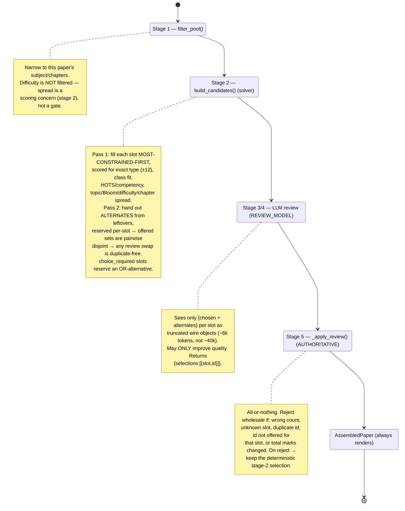
```mermaid
stateDiagram-v2
    [*] --> Filter
    Filter: Stage 1 — filter_pool()
    note right of Filter
      Narrow to this paper's subject/chapters.
      Difficulty is NOT filtered — spread is a
      scoring concern (stage 2), not a gate.
    end note
    Filter --> Candidates

    Candidates: Stage 2 — build_candidates() (solver)
    note right of Candidates
      Pass 1: fill each slot MOST-CONSTRAINED-FIRST,
        scored for exact type (±12), class fit,
        HOTS/competency, topic/Bloom/difficulty/chapter spread.
      Pass 2: hand out ALTERNATES from leftovers,
        reserved per-slot → offered sets are pairwise
        disjoint → any review swap is duplicate-free.
        choice_required slots reserve an OR-alternative.
    end note
    Candidates --> Review

    Review: Stage 3/4 — LLM review (REVIEW_MODEL)
    note right of Review
      Sees only {chosen + alternates} per slot as
      truncated wire objects (~6k tokens, not ~40k).
      May ONLY improve quality. Returns
      {selections:[{slot,id}]}.
    end note
    Review --> Validate

    Validate: Stage 5 — _apply_review() (AUTHORITATIVE)
    note right of Validate
      All-or-nothing. Reject wholesale if: wrong count,
      unknown slot, duplicate id, id not offered for
      that slot, or total marks changed. On reject →
      keep the deterministic stage-2 selection.
    end note
    Validate --> Assembled
    Assembled: AssembledPaper (always renders)
    Assembled --> [*]
```

**Pass 1 fills the most-constrained slots first**, so a rare 5-mark case study
isn't starved by a common slot consuming its only match. **Pass 2 reserves
alternates per slot**, so the offered sets are pairwise disjoint. That
guarantees *any* choice the review model makes is duplicate-free. Stage 5 is
authoritative *because a half-trusted selection is harder to reason about than a
deterministic one*, and the paper always renders. For Classes 1–8, the Bloom
and difficulty targets are class-banded. Classes 9–10 use exactly the old
shares.

`assemble_paper(use_review=False)` is fully deterministic for a given `(pool,
plan, seed)`.

### 11.5 Multiple sets

`set_variants.py` derives Sets B and C from the master (Set A) and the *same*
pool: **no new questions, no second Model 1 run.** It is pure, deterministic and
Django-free:

- MCQs are **never** replaced, so they anchor the objective section across sets.
- ~30% of the paper is replaced in **mark-priority order** (5m → 3m → 2m). Ties
  within a band are broken by each set's own RNG, so B and C don't collapse into
  one paper.
- A replacement must parallel the original on subject, chapter, type, marks,
  difficulty and Bloom. It tries topic-strict first, then topic-relaxed, and
  keeps the original rather than break the blueprint.
- Questions are shuffled *within* sections, and sections are never mixed.

Invariants: identical total marks, identical section structure, no duplicate id
within a set. Variant generation is **best-effort**, and Set A survives a
failure. Generated sets are **scoped to the paper they were generated for** and
auto-adopted by the editor. Set B/C papers get the header too.

### 11.6 Build from Bank & replace one question

**Build from Bank** (`from_bank.py`, `POST /api/generation/paper-from-bank`,
`editor/build-from-bank-dialog.tsx`). A chapter generated once already has its
questions banked, so another paper is a single Model 2 call: about two orders
of magnitude cheaper and near-instant. Bank questions keep their exact type.

**Replace one question** (`replace.py`, `POST /api/generation/replace-question`).
A teacher usually likes the paper and dislikes one item. The slot is
reconstructed from the request (marks, type, section, generator, asset type,
chapter, difficulty) and filled **from the bank first** at zero cost. Only if
the bank is exhausted does it run one small generation: a single-slot asset
call or a one-batch Model 1. Sending a different `type`/`marks` **swaps the
question type**, which the editor's swap dialog uses with the paper total in
view.

---

## 12. Durable Runs & the SSE Event Contract

### 12.1 Runs

A generation streams for thirty seconds to several minutes. That stream used to
*be* the run: close the laptop and the paper was gone. `generation_runs.py`
separates *producing* from *delivering*:

```
pipeline ──▶ record() ──▶ GenerationEvent rows ──▶ follow() ──▶ HTTP
            (one daemon thread)                  (any number of readers)
```

- The stream view starts a `GenerationRun`, runs the pipeline on a background
  thread, and returns `follow(run)`. The **first frame is `event: run
  {runId, kind, cursor}`**, so the client has something to re-attach to.
- A dropped client calls `GET /api/generation/runs/<id>/events?cursor=N`. It
  replays every frame after `N` and then tails live. Runs are scoped to their
  owner.
- `GET /api/generation/runs` lists recent runs so the UI can find one again.
- Followers **poll** the DB (0.25s → 2s backoff), because there is no broker.
- **Limit:** a run survives a client disconnect but **not a worker restart**. A
  producer silent for more than 5 minutes (`heartbeat_at`) is marked
  `abandoned` instead of hanging as "running". Surviving restarts needs a real
  task queue, and that is deliberately not faked.

**Keepalive** (`pool/keepalive.py`). The pipeline goes quiet for minutes (a
Model 1 batch, the Model 2 review), and nginx kills an upstream that has been
silent for `proxy_read_timeout`. The wrapper emits an SSE **comment**
(`: ping`) whenever nothing real was produced for a while. Consumers ignore
comments, so this needs no contract change. It also converts an exception
raised mid-stream into a terminal `event: error` frame. Without that, the
browser sees only "network error", because the 200 headers have already been
sent.

### 12.2 Events

The stream is a **hard interface** with the frontend. Both consumers, the
editor (`use-paper-generation.ts`) and the assistant (`dashboard/page.tsx`),
read it through **one shared contract**, `lib/generation-stream.ts`. Every
event is `event: <name>\ndata: <json>\n\n` (`pipeline.py::_sse`).

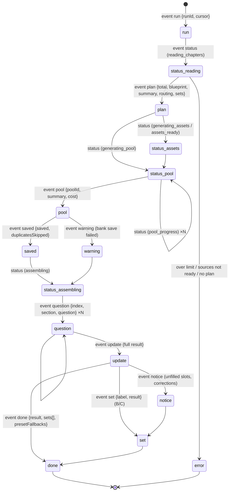
```mermaid
stateDiagram-v2
    [*] --> run: event run {runId, cursor}
    run --> status_reading: event status (reading_chapters)
    status_reading --> error: over limit / sources not ready / no plan
    status_reading --> plan: event plan {total, blueprint, summary, routing, sets}
    plan --> status_assets: status (generating_assets / assets_ready)
    plan --> status_pool: status (generating_pool)
    status_assets --> status_pool
    status_pool --> status_pool: status (pool_progress) ×N
    status_pool --> pool: event pool {poolId, summary, cost}
    pool --> saved: event saved {saved, duplicatesSkipped}
    pool --> warning: event warning (bank save failed)
    saved --> status_assembling: status (assembling)
    warning --> status_assembling
    status_assembling --> question: event question {index, section, question} ×N
    question --> question
    question --> update: event update {full result}
    update --> notice: event notice (unfilled slots, corrections)
    update --> set: event set {label, result} (B/C)
    notice --> set
    update --> done: event done {result, sets[], presetFallbacks}
    set --> done
    done --> [*]
    error --> [*]
```

| Event | Payload (key fields) | Meaning |
|---|---|---|
| `run` | `runId`, `kind`, `cursor` | First frame; the handle for re-attaching. |
| `status` | `stage`, `message`, `chapters`, `produced/target` | Progress: `reading_chapters`, `generating_assets`, `assets_ready`, `generating_pool`, `pool_progress`, `loading_bank`, `assembling`. |
| `plan` | `total`, `blueprint`, `summary`, `generalInstructions`, `routing`, `sets` | The plan was compiled. |
| `pool` | `poolId`, `byType`/`byMarks`/`byBlooms`, cost | The pool is complete. |
| `saved` | `saved`, `duplicatesSkipped`, `projectName`, `projectId` | Pool auto-saved to the bank. |
| `question` | `index`, `section`, `question` (wire), `sourceType` | One assembled slot, in order. |
| `update` | full `result` (`sections`, `generalInstructions`, `meta`) | The complete Set A document. |
| `set` | `label`, `setIndex`, `result` | A derived set (B/C). |
| `notice` | `message` | Non-fatal: unfilled slots, design corrections. |
| `warning` | `message` | Non-fatal degradation (e.g. bank save failed). |
| `done` | `result`, `sets[]`, `presetFallbacks` | Terminal success. |
| `error` | `error` (+ `code`: `DOCUMENTS_NOT_READY`, `ORG_TOKEN_LIMIT_EXCEEDED`) | Terminal failure. |

The **question wire object** (`_question_to_wire`) is the frontend's contract,
not the pool's. It uses `content` (not `question`) and `image_url` (not
`image`), carries `metadata.typeCode` and `metadata.slotIndex`, and adds
`stimulus`/`parts` for structured questions. An internal OR-choice is baked
into `content` *and* exposed as `or_choice`.

`lib/api-client.ts::streamSse` reads the `ReadableStream`, splits on `\n\n`,
skips comment blocks, and dispatches `onEvent(event, data)`, with a transparent
401 → refresh → retry.

---

## 13. Subsystem: Figures & Question Images

Nothing is drawn during generation. A teacher reads the finished paper, decides
*this* question needs a figure, and asks for it from the question hover menu
(`editor/figure-dialog.tsx`). Cost tracks intent.

**Charts are two calls, deterministic** (`services/figures/`):

1. `POST /api/generation/question-figure-spec` → `extract_figure_spec()`. A
   small model (`FIGURE_SPEC_MODEL`) reads the question and says what figure it
   wants, **and with what numbers**.
2. The teacher sees and **edits those numbers** (`chart-figure-editor.tsx`).
3. `POST /api/generation/question-figure` → `render_chart()`. There is no model,
   no network and no randomness. The same spec always renders the same SVG.

There are six chart kinds: pie, bar, histogram, line, number line and
coordinate grid. Output is **vector, black on white**, because figures are
photocopied onto answer booklets. Layout is computed from the text that has to
fit. The previous single image-model call invented wedge values, because it was
never told them, and no prompt fixes a model guessing at data.

**Pictures** (`services/question_image.py`, `POST /api/generation/question-image`)
draw one `gpt-image-1` image per click in `line_art`, `realistic` or `cartoon`
style. Quality is `high` on purpose, because a low-tier render turns label "B"
into a smudge. `OPENAI_IMAGE_CONCURRENCY` (1) caps bursts.

---

## 14. Subsystem: The Dashboard Assistant

The dashboard (`app/(dashboard)/dashboard/page.tsx`) is a working surface, not a
board of statistics. A teacher can ask the assistant anything. When what they
want is a paper, the conversation becomes a **session**: it grows a spec, asks
its outstanding question as something you tap, and ends by running the **real**
generation with a press check over it.

- **It converses, it never generates** (`services/chat_service.py`,
  `CHAT_MODEL`). Questions come from the pool pipeline on `POOL_MODEL`, so a
  chat-tuned model is never in charge of CBSE compliance.
- **Spec extraction runs after the reply**, not as a tool call during it. That
  keeps the reply streaming immediately, and one cheap call reconciles the spec
  a beat later.
- **The spec lives on the `Conversation` row**, not in the transcript. That
  makes **transcript windowing** safe (`CHAT_HISTORY_MAX_MESSAGES`,
  `CHAT_HISTORY_MAX_CHARS`) along with rolling summarisation. Dropping an old
  turn cannot lose a decision the teacher already made.
- Sessions can be parked and resumed. Starter prompts adapt to what the teacher
  has (`lib/dashboard-suggestions.ts`), and the empty state shows recent papers.

---

## 15. Subsystem: Storage, Media URLs & Branding

**The database only ever stores a permanent path** (an S3 key or a
`MEDIA_ROOT`-relative path), **never a presigned URL**. A presigned URL stored
at ingest time is stale by the time a teacher opens the paper (the infamous
`invalid_image_url` OpenAI 400). `media_urls.py` is the single authority:

- **`stable_media_url(path)`** → an app-stable `/media/<path>` URL that never
  expires. It is safe to persist, and it is served by `serve_media`, which
  **redirects to a fresh presigned URL** when storage is remote or streams from
  `MEDIA_ROOT` locally.
- **`fresh_signed_media_url(path)`** → a short-lived signed URL for immediate
  consumption only. It is never stored.

**Two S3 buckets, possibly in different regions:**

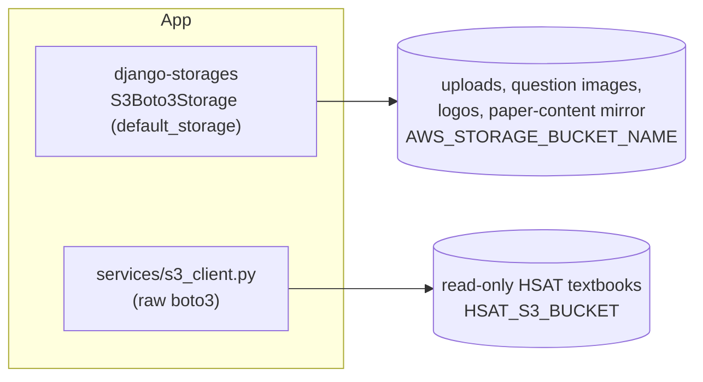
```mermaid
flowchart LR
    subgraph App
        DS["django-storages<br/>S3Boto3Storage (default_storage)"]
        S3C["services/s3_client.py<br/>(raw boto3)"]
    end
    UP[("uploads, question images,<br/>logos, paper-content mirror<br/>AWS_STORAGE_BUCKET_NAME")]
    HS[("read-only HSAT textbooks<br/>HSAT_S3_BUCKET")]
    DS --> UP
    S3C --> HS
```

Each client **must sign for its own bucket's region**, or S3 returns `403
AuthorizationHeaderMalformed`. Unset `HSAT_S3_*` falls back to the uploads
bucket, and an empty bucket name falls back to local `media/`.

**Branding.** A school's identity is stored **once**, not per paper:

- **`BrandKit`** (per teacher) holds the header layout, and **`BrandAsset`**
  holds uploaded logos (`services/brand_kit.py`, `settings/brand-kit-card.tsx`).
- **`Organization` crest** (`services/organization_logo.py`) — the school's
  logo, managed by its admin.
- The editor's **header node** prints the logo on the paper header
  (`header-logo-picker.tsx`). Both stores keep only the storage path and mint
  URLs through `stable_media_url`.

**Statelessness.** `PaperSet.content` is dual-written: DB first (authoritative),
then a best-effort S3 mirror at `paper-content/{userId}/{paperId}/{setId}.json`.
`PAPER_CONTENT_SOURCE` (`db`|`s3`) selects the read source. Logging is
stdout/stderr only, because EC2 disk is ephemeral and streams go to CloudWatch.

---

## 16. The Frontend

Next.js 16 App Router with two route groups:

- **`app/(auth)/`** — `login`, `register`, `forgot-password`, `reset-password`,
  `onboard` (accept an org-admin invite and create a school).
- **`app/(dashboard)/`** — `dashboard` (assistant), `editor`, `papers` (paper
  library + drafts + recycle bin), `questions` (question bank), `templates`
  (template manager), `settings` (profile, brand kit), `admin` (members,
  invites, domains, usage), `admin/organizations/[id]`.

The old `/paper-library` and `/question-bank` routes were named the opposite of
what they held. They now redirect to `/questions` and `/papers`
(`next.config.ts`).

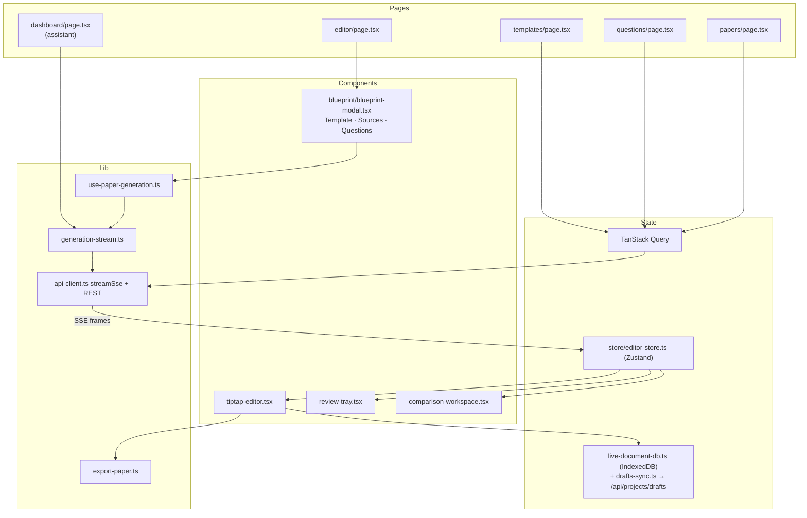
```mermaid
flowchart TB
    subgraph Pages
        DASH["dashboard/page.tsx<br/>(assistant)"]
        EDIT["editor/page.tsx"]
        PAP["papers/page.tsx"]
        QS["questions/page.tsx"]
        TPLP["templates/page.tsx"]
    end
    subgraph Components
        BB["blueprint/blueprint-modal.tsx<br/>Template · Sources · Questions"]
        TT["tiptap-editor.tsx"]
        TRAY["review-tray.tsx"]
        CMP["comparison-workspace.tsx"]
    end
    subgraph State
        STORE["store/editor-store.ts (Zustand)"]
        IDB["live-document-db.ts (IndexedDB)<br/>+ drafts-sync.ts → /api/projects/drafts"]
        RQ["TanStack Query"]
    end
    subgraph Lib
        API["api-client.ts streamSse + REST"]
        GS["generation-stream.ts"]
        UPG["use-paper-generation.ts"]
        EXP["export-paper.ts"]
    end

    EDIT --> BB --> UPG --> GS --> API
    DASH --> GS
    API -->|SSE frames| STORE
    STORE --> TT
    STORE --> TRAY
    STORE --> CMP
    TT --> IDB
    TT --> EXP
    PAP --> RQ --> API
    QS --> RQ
    TPLP --> RQ
```

**The Blueprint Builder** (`components/blueprint/`) replaced the 1,865-line
generator sidebar. It has three steps (**Template**, **Sources**, **Questions**)
that can be visited in any order once a template is chosen, plus a footer that
always shows question count, marks and how many come from the bank. A new slot
inherits the previous slot's type and marks.

**The editor** (`tiptap-editor.tsx`) uses custom TipTap NodeViews under
`components/editor/extensions/`: `page-node` and `pagination-engine` /
`pagination-fit` (A4 reflow, with undo-safe block moves),
`header-node` (brand header with logo), `math-nodes` (KaTeX), `float-image`, and
`or-group-invariant`. Around it are the toolbar, the document outline with set
tabs, find/replace, and the **question hover menu**: replace, swap type and
marks, add figure, copy from library. There are also a review tray, a blank
state that offers a starting point, and a generate dock.
`app/pagination-harness` is a browser harness for the pagination engine.

**Insertion modes.** The store models `review` vs `auto` insertion. In review
mode, each streamed question lands in the review tray, badged by `sourceType`.
`SectionToAppend.setLabel` lets multiple sets coexist ("Set B · Section A").

**Persistence.** Documents go to **IndexedDB** (`live-document-db.ts`), one
document per set tab, because they are too big for localStorage. Unsaved drafts
sync to the server and show their remaining days on the Papers page. The Zustand
store persists only small UI state to localStorage.

**Export is 100% client-side and has one path.** `lib/export-paper.ts` handles
PDF and DOCX, the filename prompt, toasts and the S3 backup. A second,
URL-param copy used to send the composed tab id (`{base}_A`) and silently 404
its backup. `export-pdf.ts` rasterises with html2canvas + jsPDF, and
`export-docx.ts` uses the `docx` package (SVG figures rasterised at 2×).

**UX/a11y pass** (late August, `docs/`): every empty state has a way out,
failed loads offer retry, primary buttons meet contrast in dark mode,
`prefers-reduced-motion` is honoured, there is a first-run primitive, one scrim
recipe and a documented z-index scale, and all page titles share one scale and
a display face.

> `next.config.ts` pins the Turbopack `root` to `frontend/`. Do **not** remove
> it: without it, Next walks up to the monorepo root and watches ~69k files. It
> also **fails a production build without `NEXT_PUBLIC_API_BASE_URL`**, because
> that value is inlined at build time.

---

## 17. Configuration & Feature Flags

All backend config is env-driven (`config/settings.py`, template in
`backend/.env.example`). **`DATABASE_URL` and `OPENAI_API_KEY` are required**,
and settings raise if they are missing. Tests swap to in-memory SQLite when
`test` is in `sys.argv`.

**Models** (each stage is explicit, and none inherits `OPENAI_MODEL`):

| Var | Stage | Default |
|---|---|---|
| `POOL_MODEL` | Model 1 | `gpt-4.1-mini` |
| `REVIEW_MODEL` | Model 2 review | `gpt-4.1-mini` |
| `ANSWER_MODEL` | answer keys / scripts | `gpt-4.1-mini` |
| `ASSET_MODEL` | English asset generators | falls back to `POOL_MODEL` |
| `CHAT_MODEL` | dashboard assistant | `gpt-4.1-mini` |
| `FIGURE_SPEC_MODEL` | chart spec extraction | `gpt-4.1-mini` |
| `OPENAI_VISION_MODEL` / `OCR_MODEL` | OCR (`OCR_MODEL` falls back to vision) | `gpt-4.1-mini` |
| `OPENAI_IMAGE_MODEL` / `_SIZE` / `_QUALITY` | on-demand pictures | `gpt-image-1` / `1024x1024` / `high` |
| `OPENAI_EMBEDDING_MODEL` | retrieval | `text-embedding-3-small` |
| `OPENAI_MODEL` | legacy/blueprint fallback only | `gpt-4.1-mini` |

> **Per-stage isolation is deliberate.** A deployment that set
> `OPENAI_MODEL=gpt-4o` (a 30k-TPM model) must not drag Model 1's whole-chapter
> request into that ceiling.

**Behaviour:**

| Var | Effect | Default |
|---|---|---|
| `QG_NEW_ENGINE_ENABLED` | route blueprint through the dormant `apps/question_generation/` | `false` |
| `POOL_EXACT_MARGIN_PERCENT` | spare margin on the exact pool size (0 = literally exact) | `15` |
| `POOL_MAX_CONCURRENCY` | process-wide cap on concurrent Model 1 requests (TPM) | `4` |
| `POOL_CHAPTER_CONCURRENCY` | chapters generated in parallel | `3` |
| `POOL_CHAPTER_TOKEN_THRESHOLD` | split a chapter larger than this (input tokens) | `20000` |
| `POOL_MIN_QUESTIONS_PER_CHAPTER` | floor per-chapter slice of the pool | `12` |
| `CHAPTER_MD_MAX_CHARS` | cap on one chapter's Markdown | `240000` |
| `ASSET_REUSE_ENABLED` | reuse banked assets as extra candidates | `true` |
| `OPENAI_IMAGE_CONCURRENCY` | concurrent picture requests | `1` |
| `OPENAI_TIMEOUT_SECONDS` | per-call ceiling (keep below gunicorn `--timeout`) | `120` |
| `PDF_OCR_ENABLED` / `_MIN_PAGE_CHARS` / `_MAX_PAGES` / `_MAX_PIXELS` / `_CONCURRENCY` | scanned-PDF OCR | `true` / `80` / `60` / `1800` / `4` |
| `PDF_MIN_DOC_CHARS_PER_PAGE` | reject an upload below this after OCR | `120` |
| `INGEST_EXTRACT_FIGURES` | store figure chunks at ingest | `false` |
| `INGEST_EMBEDDINGS_ENABLED` / `INGEST_EMBED_BATCH_SIZE` | embeddings at ingest | `true` / `256` |
| `CHAT_HISTORY_MAX_MESSAGES` / `_MAX_CHARS` | assistant transcript window | `24` / `24000` |
| `PAPER_TRASH_RETENTION_DAYS` | recycle-bin lifetime | `30` |
| `DRAFT_RETENTION_DAYS` | server draft lifetime (match `frontend/lib/drafts.ts`) | `10` |
| `GENERATION_RUN_RETENTION_DAYS` | run/frames lifetime | `7` |
| `USD_TO_INR` / `MODEL_PRICING_USD_JSON` | spend reporting | `88.0` / built-in table |
| `PAPER_CONTENT_SOURCE` | `db` or `s3` for reading paper content | `db` |
| `REDIS_URL` | shared cache backend when set | unset (LocMem) |

**Removed:** `IMAGE_QUESTION_STRATEGY`, `IMAGE_QUESTIONS_PER_POOL`,
`IMAGE_COST_USD_PER_IMAGE` (the image stage is gone; they are ignored if still
set) and `ENABLE_TEST_ENDPOINTS` (its endpoint is now the `run_engine_slice`
command).

---

## 18. Deployment Topology

Runbooks live in `deployment/`: `nginx.conf`, `qp-gen-backend.service`,
`qp-gen-retention.service` + `.timer`, `POOL_MIGRATION.md`.

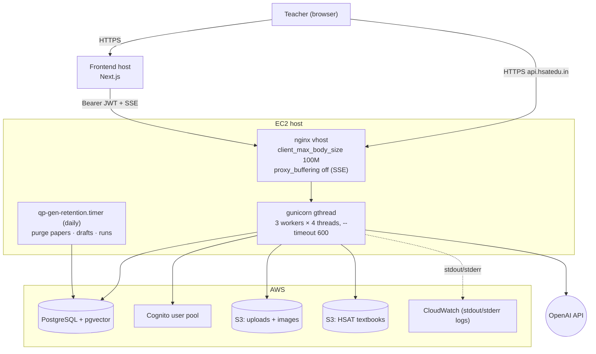
```mermaid
flowchart TB
    U["Teacher (browser)"] -->|HTTPS| CF["Frontend host<br/>Next.js"]
    U -->|HTTPS api.hsatedu.in| NGINX

    subgraph EC2["EC2 host"]
        NGINX["nginx vhost<br/>client_max_body_size 100M<br/>proxy_buffering off (SSE)"]
        GUNI["gunicorn gthread<br/>3 workers × 4 threads, --timeout 600"]
        RET["qp-gen-retention.timer (daily)<br/>purge papers · drafts · runs"]
        NGINX --> GUNI
    end

    subgraph AWS
        PG[("PostgreSQL + pgvector")]
        COG["Cognito user pool"]
        S3U[("S3: uploads + images")]
        S3H[("S3: HSAT textbooks")]
        CW["CloudWatch (stdout/stderr logs)"]
    end

    OAI(("OpenAI API"))

    GUNI --> PG
    GUNI --> COG
    GUNI --> S3U
    GUNI --> S3H
    GUNI --> OAI
    RET --> PG
    GUNI -.stdout/stderr.-> CW
    CF -->|Bearer JWT + SSE| NGINX
```

Constraints baked into the code:

- SSE responses set `Cache-Control: no-cache` and `X-Accel-Buffering: no`, and
  nginx must have `proxy_buffering off`.
- Keepalive pings stop nginx's `proxy_read_timeout` from cutting quiet streams.
  gunicorn's `--timeout 600` must stay above `OPENAI_TIMEOUT_SECONDS`.
- **gthread workers**: a generation holds its worker for minutes. With sync
  workers, 3 workers meant 3 concurrent generations site-wide.
- Upload bodies are capped at 100M at both nginx and Django.
- The **daily retention sweep** runs `purge_deleted_papers`,
  `purge_expired_drafts` and `purge_generation_runs`.
- The app is designed to run **stateless** (shared Redis, S3-mirrored content,
  console-only logging). Durable runs are the exception: they survive a client
  disconnect, not a worker restart (§12.1).
- The frontend needs `NEXT_PUBLIC_API_BASE_URL` at **build** time.

---

## 19. Design Trade-offs & Alternatives Considered

| Decision | Alternative considered | Why the current design won |
|---|---|---|
| **Pool architecture** (read chapter once, then select) | Per-slot RAG + one LLM call per question | ~10× cost, and retrieval-clustered questions gave uneven coverage. |
| **Exact pool + spares** | Fixed ~2× over-provisioned pool | The teacher already fixed the slots in the Builder; writing 90 to place 38 paid for 52 nobody asked for. The margin covers normalisation losses. |
| **Templates as the only front door** | Board mode vs General Instructions mode | A teacher shouldn't have to know which mode they are in before saying what they want; every starting point is editable. |
| **Pinned vs instruction-driven templates** | Always freeze the resolved layout | A frozen layout stops responding to its instructions; but once a teacher edits a slot, re-deriving from prose would discard the edit. |
| **Model designs, Python validates** (prose → paper) | Regex grammar only (`gim.py`) | Teachers don't write "5 MCQs of 1 mark"; they write "weekly test, mostly recall, 20 marks". |
| **Asset generators for English A/B** | Better prompts on the chapter pool | Reading needs *unseen* text. The section must decide the generator; no prompt fixes a textbook-grounded Reading section. |
| **Solver + single LLM review** in Model 2 | Let the LLM assemble the paper | A solver is better at exact constraint satisfaction; the LLM is kept for semantic duplication. |
| **Stage 5 is authoritative** | Repair a partially-valid review | A half-trusted selection is impossible to reason about; the stage-2 pick is always valid. |
| **On-demand figures** | Speculative image stage during generation | The stage was ~85% of cost and drew figures nobody asked for. |
| **Spec-then-render charts** | One image-model call per chart | The image model invented the data. A deterministic renderer fed teacher-checked numbers is correct and free. |
| **Durable runs on DB polling** | Celery/Redis task queue | No broker in this deployment. Polling survives disconnects today; surviving restarts is honestly out of scope. |
| **Assistant converses, never generates** | Let the chat model write questions | Keeps CBSE compliance on the pool pipeline and its model. |
| **Spec on the Conversation row** | Spec in the transcript | Makes transcript windowing safe. |
| **Reconstruct chapters from chunks** | Add a `markdown_content` column | Avoids a migration + backfill + re-upload. |
| **Bare JSON array from Model 1** | `response_format=json_object` | A wrapper only closes on the last token, so nothing could stream. |
| **`content_hash` index, app-level dedup** | `UNIQUE` constraint | The live Prisma table already holds duplicates. |
| **`PortableArrayField`** | Migrate `options` to `JSONField` | Keeps the prod `text[]` column while making the auto-save path testable under SQLite. |
| **Store paths, mint presigned URLs on use** | Persist presigned URLs | Persisted presigned URLs expire and cause OpenAI 400s. |
| **Catalogue code + shape** | Replace shapes with ~160 types everywhere | Every `== "MCQ"` check and board prompt stays byte-identical; old data resolves through aliases. |
| **Client-side export** | Server-side rendering | Keeps the backend stateless; the editor DOM is already the source of truth. |

---

## 20. Testing Strategy

Backend tests are Django `TestCase`s (**not** pytest) and need no DB setup. Settings
auto-swap to in-memory SQLite. Tests live in app `tests.py`/`test_*.py` files and
in `test_*.py` modules under `services/`, `services/pool/`, `services/assets/`,
`services/figures/` and `services/question_types/`.

```bash
cd backend && source venv/bin/activate      # venv is venv/, NOT .venv
python manage.py test                        # everything
python manage.py test services.pool          # the pool pipeline
python manage.py test services.question_types
python manage.py export_question_types --check   # frontend type module in sync?
python manage.py test services.pool.test_model1.StreamExtractorTests.test_x  # one test
```

Notable suites:

- `services/pool/` — `test_model1` (stream extractor, normalisation),
  `test_model2` + `test_or_choice` (candidates, authoritative apply, OR
  reservation), `test_set_variants`, `test_chapters`, `test_structure`,
  `test_replace`, `test_keepalive`, `test_recipes`, `test_pipeline`,
  `test_english_pipeline`, `test_gim`.
- `services/question_types/` — catalogue integrity, identity/aliases, export,
  subjects, generation briefs.
- `services/assets/` — generators and routing. `services/figures/` — specs and
  deterministic SVG.
- `services/test_*.py` — content filters, chapter Markdown, source readiness,
  OCR, ingest concurrency, PDF validation, paper design, templates, question
  image, usage pricing, answer formats.
- `apps/generation/test_generation_runs.py`, `test_design_api.py`;
  `apps/accounts/test_brand_kit.py`; app `tests.py` for organizations, chat,
  projects, documents.
- `apps/question_generation/tests/test_parity.py` and `q_instructions/tests/*` —
  dual-engine parity + blueprint invariants.

**Frontend:** `tsc --noEmit`, `eslint`, and node self-check scripts in
`frontend/scripts/` (`node scripts/test-question-nodes.mjs`, `test-drafts`,
`test-paper-id`, `test-pagination-fit`, `test-plan-summary`, `test-set-content`,
…). `/pagination-harness` exercises the pagination engine in a browser.
What still needs a human is listed in `docs/manual-test-checklist.md`.

---

## Appendix A — API Endpoints

`APPEND_SLASH=False`. Most endpoints have **no trailing slash**; the ones that
do are written with it.

**Generation** — `/api/generation/`

| Method | Path | Purpose |
|---|---|---|
| `POST` | `questions/stream` | Full generation as a recorded run, SSE. |
| `GET` | `runs` | Recent runs (for re-attaching). |
| `GET` | `runs/<id>/events?cursor=N` | Replay + follow a run, SSE. |
| `POST` | `paper-from-bank` | Assemble from saved questions, SSE. |
| `POST` | `replace-question` | Replace or re-type one question. |
| `GET` | `bank-summary` | Per-chapter saved-question counts. |
| `POST` | `design-paper` | Prose → validated paper design. |
| `GET`/`POST` | `templates` | List (built-in + saved) / create. |
| `POST` | `templates/resolve` | Resolve a card or brief → blueprint + detected settings. |
| `POST` | `templates/fork` | Fork a template. |
| `*` | `templates/<id>`, `templates/<id>/duplicate` | Edit / delete / duplicate. |
| `*` | `template-folders`, `template-folders/<id>` | Template folders. |
| `GET` | `question-types` | Catalogue menu for a subject/class. |
| `POST` | `question-figure-spec` · `question-figure` | Chart spec → deterministic SVG. |
| `POST` | `question-image` | One on-demand picture. |
| `POST` | `papers/<id>/generate-answer-script/` | CBSE marking scheme as a new paper. |
| `POST` | `answer-key` | Answer key from HTML (no frontend caller). |
| `GET`/`DELETE` | `history` | Generation history. |

**Documents & library** — `/api/documents/`, `/api/hsat/`

| Method | Path | Purpose |
|---|---|---|
| `POST` | `documents/upload` | Multipart upload (async ingest). |
| `POST` | `documents/presign` · `documents/confirm` | Direct-to-S3 upload. |
| `POST` | `documents/detect-subject` · `analyze-pdf` · `validate-metadata` | Pre-upload checks. |
| `GET` | `documents/<id>/status` | Poll ingestion. |
| `GET` | `hsat/catalog/` · `hsat/chapters/` | Shared textbook catalogue. |
| `POST` | `hsat/ingest/` · `hsat/apply/` | Ingest / apply a library book. |
| `GET` | `hsat/sources/<id>/status/` · `hsat/papers/<id>/sources/` | Status / a paper's sources. |

**Projects** — `/api/projects/`

| Method | Path | Purpose |
|---|---|---|
| `*` | `papers/`, `papers/<id>/` | Paper list / detail (delete = recycle bin). |
| `GET` | `papers/trash` | Recycle bin. |
| `POST` | `papers/<id>/restore` | Restore from the bin. |
| `*` | `drafts`, `drafts/<scope>` | Server-synced drafts. |
| `*` | `questions/save`, `questions/<id>/`, `questions/types`, `questions/clear`, `papers/clear` | Question bank. |

**Accounts, organizations, chat, storage**

| Method | Path | Purpose |
|---|---|---|
| `GET` | `/api/auth/profile` | Current user. |
| `*` | `/api/auth/brand-kit`, `brand-kit/assets[/<id>]` | Brand kit + logos. |
| `*` | `/api/auth/users`, `users/<id>/approve`, `users/<id>/reject` | Platform user approval. |
| `*` | `/api/organizations/` (`public`, `join`, `switch`, `usage`, `analytics`) | Schools, membership, usage. |
| `*` | `/api/organizations/<id>` (`/logo`, `/members`, `/members/<uid>[/approve\|/reject]`, `/invites`) | One school. |
| `*` | `/api/organizations/invites`, `invites/accept`, `invites/<id>` | Create / accept / revoke invites. |
| `*` | `/api/chat/conversations[/<id>[/status\|/messages]]` | Assistant sessions. |
| `POST`/`GET` | `/api/storage/upload-export/` · `export-url/` | Export backup to S3. |
| `GET` | `/api/health/` | Health check. |
| `GET` | `/media/<path>` | Stable media resolver → presigned redirect / local stream. |

## Appendix B — Environment Variables & Commands

See §17 for behaviour flags. Additional required/notable vars:

- **Required:** `DATABASE_URL`, `OPENAI_API_KEY`, `AWS_COGNITO_APP_CLIENT_ID`
  (fails closed if unset), `AWS_COGNITO_USER_POOL_ID`, `AWS_COGNITO_REGION`.
- **Storage:** `AWS_STORAGE_BUCKET_NAME`, `AWS_S3_REGION_NAME`, `HSAT_S3_BUCKET`,
  `HSAT_S3_REGION`, `AWS_ACCESS_KEY_ID`, `AWS_SECRET_ACCESS_KEY`,
  `AWS_S3_ENDPOINT_URL` (MinIO).
- **Frontend:** `NEXT_PUBLIC_API_BASE_URL` (build time),
  `NEXT_PUBLIC_AWS_COGNITO_APP_CLIENT_ID` (must match the backend),
  `NEXT_PUBLIC_AWS_COGNITO_REGION`.
- **Ops:** `REDIS_URL`, `PAPER_CONTENT_SOURCE`, `DJANGO_ALLOWED_HOSTS`,
  `EXTRA_ALLOWED_ORIGINS`, `FRONTEND_URL`, `DJANGO_DEBUG`, `DATABASE_SSL_REQUIRE`,
  `EMAIL_BACKEND`/SMTP vars, `PASSWORD_RESET_TIMEOUT_SECONDS`.

Management commands: `seed_superadmin`, `export_question_types`,
`purge_deleted_papers`, `purge_expired_drafts`, `purge_generation_runs`,
`backfill_set_content_to_s3`, `run_engine_slice`, `verify_s3`,
`strip_vi_from_chunks`.

---

*This document reflects `main@d6e7a9d`. Diagrams are authored in Mermaid and
render natively in GitHub, VS Code, and most Markdown viewers. When the code
changes, update the affected section and its diagram together — a stale diagram
is worse than none.*
